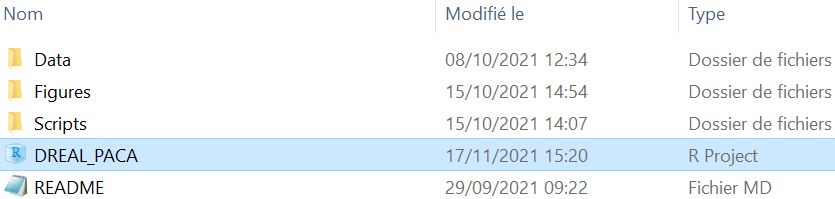
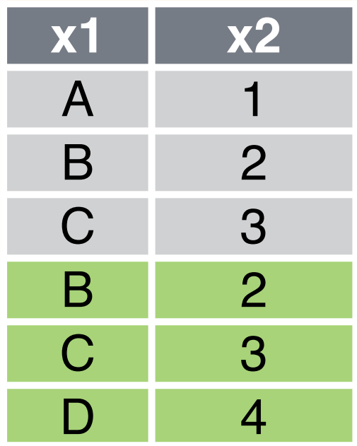
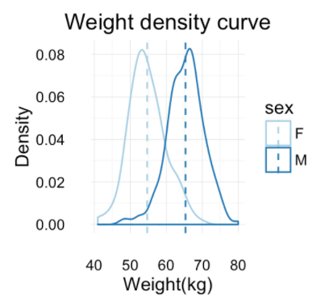
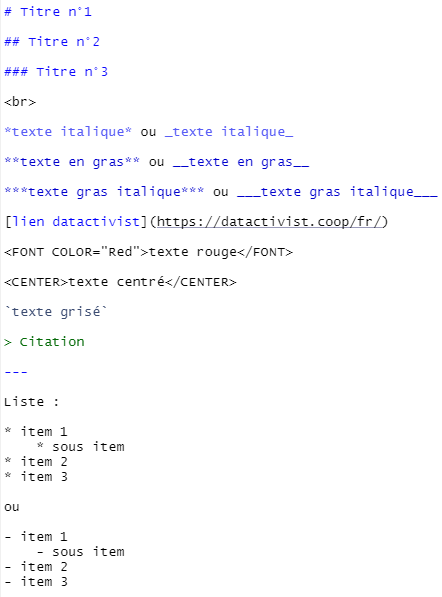

<style>
body {
text-align: justify}
</style>

```{r setup, include=FALSE}
knitr::opts_chunk$set(echo = TRUE, eval = TRUE, message = FALSE, warning = FALSE, collapse = TRUE,  fig.show = "hold", out.width = "100%", fig.align='center', 
                      comment = ' #>')
```

```{r klippy, echo=FALSE, include=TRUE}
klippy::klippy(position = c('top', 'right'), color = '#333333', tooltip_message = 'Cliquer pour copier')
library(kableExtra)
```

<br> 

Cette formation a pour but de rendre **accessible à tous** la programmation en R. Pour cela, nous introduirons la notion de programmation dans un contexte général, puis nous nous pencherons sur le langage R en partant d'une vue globale pour entrer petit à petit dans les manipulations techniques. 

```{r icon-style, include=FALSE}
#remotes::install_github("mitchelloharawild/icons")
library(icons)
```

<br>

<br>


---

# `r icon_style(fontawesome("code", style = NULL), fill = "#0000CC")` <FONT COLOR="#0000CC">La programmation</FONT>

<br>

<br>

* **Qu'est-ce que la programmation ?**

Comme nous l'informe *Wikipédia*, la programmation - aussi appelée **codage** ou **développement**, désigne l'ensemble des activités qui permettent l'écriture de programmes informatiques. Cette écriture de programmes se fait dans un **langage de programmation**, les 10 principaux langages sont les suivants : HTML/CSS, JavaScript, PHP, Ruby, Java, Swift, C#, C ou C++, Python, Julia et Scala. **R** est aussi un langage de programmation qui est, lui, davantage axé sur l'**analyse statistique**.

<br>

* **Pourquoi la programmation ?**

La troisième révolution industrielle, connue sous le nom de "révolution informatique" s'accompagne d'une création de 2.5 trillions d'octets de données chaque jour. C'est dans ce contexte d'**abondance des données** qu'est née la science des données, visant à obtenir des informations et des connaissances à partir des données qui génèrent de la valeur. Le schéma ci-dessous peut aider à comprendre **comment** exploiter la valeur des données :

```{r echo=FALSE, out.width='52%', fig.align='center'}
knitr::include_graphics(here::here("images/cycle_data.png"))
```

<br>

<br>


---

# `r icon_style(fontawesome("eye", style = NULL), fill = "#0000CC")` <FONT COLOR="#0000CC">Vue globale du langage R</FONT>

<br>

* **Qu'est-ce que R ?**

Comme dit précédemment R est un **langage de programmation** en libre accès créé en 1993, destiné aux statistiques et à la science des données.

<br>

* **Pourquoi R ?**

```{r echo=FALSE, out.width='52%', fig.align='center'}
knitr::include_graphics(here::here("images/r_cars.jfif"))
```

Gratuit, facile d'accès, puissant, reproductible, design, le langage R est à la fois pertinent pour analyser les données, les visualiser et générer des rapports qui permettent - comme celui-ci, de mélanger du code, du texte et des graphiques. 

<br>

* **Comment coder en R ?**

Pour coder en R on utilise généralement l'interface **R studio** qui permet d'interagir avec le langage R de manière *aisée.* Quoi qu'il en soit, l'image partagée par Sylvain montre que la programmation est un apprentissage infini :

```{r echo=FALSE, out.width='30%', fig.align='center'}
knitr::include_graphics(here::here("images/using_r.jpeg"))
```

<br>

* **Installer R sur sa machine**

Pour installer l'interface RStudio il faut dans un premier temps **installer R** et dans un second temps **télécharger l'application RStudio**. Les liens de téléchargements sont disponibles sur le site [rstudio.com](https://www.rstudio.com/products/rstudio/download/#download). 

<br>

* **Configurer R**

Une fois l'installation terminée, il est important de configurer RStudio pour faciliter le travail sur l'interface et les partages de documents. Les paramètres généraux se trouvent dans le menu : *Tools > Global Options*

Vous pouvez configurer le '*General*' et le '*Code*' de la manière suivante :


```{r echo=FALSE, out.width='90%', fig.align='center', fig.asp=0.55}
library(cowplot)
library(ggplot2)

p1 <- ggdraw() + draw_image("images/options_R.png", scale = 0.9)
p2 <- ggdraw() + draw_image("images/options2_R.png", scale = 0.9)

plot_grid(p1, p2)
```


Il est aussi important de configurer la **sauvegarde** des scripts ; il faut spécifier un codage "UTF-8" pour que les caractères spéciaux de chaque script enregistré soient traités correctement, et ainsi faciliter le partage de codes. Cette option est disponible dans la fenêtre des *Global Options > Code > Saving > Default text encoding > Change... > UTF-8*. Enfin, dans cette même fenêtre des options générales de RStudio - dans l'option "***Appearance***", vous pouvez personnaliser l'apparence de votre interface en modifiant la police, la taille du texte, le thème etc.

```{r echo=FALSE, out.width='90%', fig.align='center', fig.asp=0.55}
p1 <- ggdraw() + draw_image("images/options3_R.png", scale = 0.9)
p2 <- ggdraw() + draw_image("images/options4_R.png", scale = 0.9)
plot_grid(p1, p2)
```

Ne pas oublier d'appliquer ces changements ('*Apply*') avant de fermer la fenêtre des options ('*Ok*').

<br>

* **Décomposition d'une fenêtre R**

Une fenêtre R à son ouverture est décomposée en 3 parties, 4 en diminuant la taille de la partie inférieure en cliquant sur le bouton `r icon_style(fontawesome("window-restore", style = NULL), fill = "#666666")` (ou via le menu : *View > Panes > Show all panes*). La programmation à proprement parler se fait dans la partie supérieure gauche, c'est là où on écrit les scripts que l'on pourra ensuite sauvegarder. 

NB : il est aussi possible de coder directement dans la console (partie inférieure gauche), la commande sera exécutée mais ne sera pas sauvegardée ; ça peut donc être intéressant pour exécuter une commande de manière instantanée (un calcul par exemple).

```{r echo=FALSE, out.width='80%', fig.align='center', strip.white=TRUE}
knitr::include_graphics(here::here("images/demarrage_R.png"))
```

\vspace{-3cm}

La partie inférieure droite est décomposée en 5 onglets :

* **Files** : les fichiers de l'ordinateur
* **Plots** : les graphiques créés apparaîtront ici
* **Packages** : liste de tous les *packages* installés sur la machine (nous reviendrons sur la notion plus tard)
* **Help** : onglet où l'on trouve toute l'aide nécessaire sur l'utilisation des fonctions
* **Viewer** : les objets interactifs créés (graphiques, cartes, tableaux) apparaîtront ici

<br>

* **L'environnement R**

Un avantage incontournable de R est la **communauté** qui existe autour pour trouver des ressources, de l'aide, de l'inspiration etc. On trouve notamment [R-bloggers](https://www.r-bloggers.com/) avec des nouveautés et des tutoriels écrits par des utilisateurs du langage, [RStudio Community](https://community.rstudio.com/) pour trouver/donner de l'aide (comme un *#TeamOpenData* de RStudio), [Stack Overflow](https://stackoverflow.com/) où l'on trouve la majorité des réponses aux questions de programmation - la plateforme n'est cependant pas propre à R. 

Il est aussi possible de relier RStudio à **Git**, ce qui permet de déposer du code, des bases de données et des objets créés (graphiques, cartes, documents html..) sur [github](https://github.com/). Les fichiers sont ainsi centralisés et sauvegardés sur un *repository* qui permet de collaborer facilement sur un projet. 

<br>


* **Le lexique de R**

<FONT COLOR="#CC0000">coder</FONT> = programmer

<FONT COLOR="#CC0000">ligne de commande</FONT> = ligne de code

<FONT COLOR="#CC0000">runer</FONT> = exécuter une commande (bouton '*Run*')

<FONT COLOR="#CC0000">package</FONT> = ensemble de fonctions

<FONT COLOR="#CC0000">library</FONT> = endroit où sont gardés les packages

<FONT COLOR="#CC0000">working directory</FONT> = répertoire de travail

<br>

* **Les types de documents pour travailler avec R**

Les principaux documents que l'on peut créer à partir de l'interface RStudio sont les suivants :

* **R Script**, extension *".R"* **:** document le plus basique où l'on peut (seulement) écrire du code et l'exécuter - très fonctionnel
* **R Markdown**, extension *".Rmd"* **:** document où l'on peut combiner du texte, du code, des graphiques et des tableaux de manière esthétique, comme celui-ci
* **Shiny web app**, extension *".R"* **:** application interactive où l'on peut assembler des visualisations et des tableaux

Pour créer un nouveau document il faut aller dans le menu : *File > New File > choisir celui que vous voulez créer*, ou sur le `r icon_style(fontawesome("plus-circle", style = NULL), fill = "#009900")` juste en dessous du '*File*' dans la barre de menu.

<br>

* **Travailler avec des projets R**

Ces documents peuvent être créés/ouverts **seuls** ou dans un **projet** : {width=3%}. Un *Rproject* est utile dès lors que l'on travaille sur une analyse avec de nombreux fichiers (données, scripts, images...) et en collaboration avec d'autres personnes. Il est effectivement possible d'organiser son espace de travail à partir de l'objet '***.Rproj***' :

* celui-ci se trouve dans un dossier où l'on **centralise tous les fichiers** nécessaires à l'analyse 
* depuis l'emplacement où se trouve le projet on peut créer des **sous-dossiers** pour organiser le travail
* en ouvrant dans RStudio le projet, les fichiers créés autour de celui-ci apparaissent dans la **partie inférieure droite de la fenêtre de RStudio**, ils sont donc accessibles facilement comme nous le voyons ici

<center>

{width=60%}

</center>

<center>

{width=60%}

</center>

<br>

* il est alors possible d'appeler toute sorte d'objets (images, bases de données) en utilisant un **chemin relatif** et non un chemin global. Pour importer des données par exemple, le chemin global serait le suivant :

<center>

`data <- read_csv("C:/Users/name/desktop/mon_projet/data/base.csv")`

</center>

La limite de cette méthode apparaît quand on veut **partager** le code à quelqu'un d'autre qui n'aura pas le même chemin d'accès (ne serait-ce que pour le *nom d'utilisateur*). En travaillant dans un projet R, les chemins d'accès aux documents seront **relatifs** puisqu'ils débutent à l'endroit où l'on travaille (working directory), c'est-à-dire à l'emplacement du *.Rproj*. La commande pour importer les données avec le **chemin relatif** serait la suivante :

<center>

`data <- read_csv("./data/base.csv")`

</center>

Le point "**.**" correspond au répertoire de travail c'est-à-dire à l'emplacement du *RProject* ici. Le dossier avec le projet R peut être déplacé et partagé, l'import continuera de fonctionner grâce au chemin relatif. 

Pour créer un nouveau projet il faut aller dans le menu : *File > New Project > New Directory > New Project > entrer un nom de projet, éventuellement changer l'espace de travail > Create Project*, ou à partir du `r icon_style(fontawesome("plus-circle", style = NULL), fill = "#009900")` juste en dessous du '*Edit*' dans la barre de menu.

<br>

<style>
div.blue { background-color:#efefef; border-radius: 5px; padding: 20px;}
</style>
<div class = "blue">

 `r icon_style(fontawesome("thumbs-up", style = "solid"), fill = "#666666")`  <FONT COLOR="#333333">**Bonne pratique**

Un bon réflexe à prendre dès le début de votre carrière de programmeur est de ne laisser **aucun espace blanc** dans les noms des fichiers/dossiers, de manière à ce qu'ils puissent être lus à la fois par des personnes mais aussi par des machines. Les bons séparateurs des mots sont alors `-`ou `_`. Il est aussi recommandé de ne **pas mettre d'accent**, pour prévenir d'éventuels problèmes d'encodage. 

*Exemple de **mauvais nom** :* `Extraction des données de data.gouv.R`

*Exemple de **bon nom** :* `Extraction_donnees_data-gouv.R`</FONT>

</div>

<br>

<br>


---

# `r icon_style(fontawesome("search", style = NULL), fill = "#0000CC")` <FONT COLOR="#0000CC">Science et analyse des données avec R</FONT>

<br>


Maintenant que la notion de programmation est plus claire et que vous connaissez les rouages du langage R, nous allons entrer dans le vif du sujet en apprenant à manier les données ; que ce soit la mise en forme, l'analyse ou la visualisation. Cette partie reprendra étape par étape le schéma d'exploitation des données que nous avons vu en première partie :

```{r echo=FALSE, out.width='52%', fig.align='center'}
knitr::include_graphics(here::here("images/cycle_data.png"))
```

<br>

* **Deux manières de coder en R**

Avant de nous pencher sur l'import de données, voyons les deux manières de coder en R : le R-base et le tidyverse. La programmation dans le langage R a été révolutionnée ces dernières années par le statisticien *Hadley Wickham* et son équipe, qui ont développé le **tidyverse**. Contraction de *tidy* et *universe*, le tidyverse est une collection de packages R qui ont tous la même structure, simplifiant ainsi leur utilisation pour la data science. 


<div class="row">
<div class="col-md-2">
{width=120%}
</div>
<div class="col-md-10">

<br>

Le tidyverse fonctionne grâce au **pipe** (%>%) contenu dans le package `magrittr`, qui permet d'appliquer un certain nombre de fonctions à une base de données. Le code est alors plus lisible grâce à une structuration des séquences d'opérations de **gauche à droite** (et non de l'extérieur à l'intérieur comme en R-base), qui permet d'**ajouter des étapes** n'importe où dans les séquences d'opérations. 
</div>
</div>


Un exemple de code en R-base et en tidyverse : 

* **R-base** : `h(g(f(x)))`
* **tidyverse** : `x %>% f %>% g %>% h`

Nous apprendrons à coder seulement en tidyverse dont l'approche est beaucoup plus simple pour débuter la programmation. 

<br>

* **Coder sous R : les bases**

Pour **exécuter** du code il faut placer son curseur sur la ligne de commande, puis cliquer sur le bouton {width=5.7%} en haut de la fenêtre, ou appuyer sur les touches *Ctrl-Enter*. Pour exécuter plusieurs lignes de code simultanément il suffit de les **sélectionner** avant de les *runer*. vous pouvez notamment vous entraîner en *runant* de simples opérations arithmétiques : 

```{r}
13+4
5*2
13+4-5*2
```


Il est possible d'**assigner** une valeur à un objet (dataframe, liste, vecteur, fonction...) avec `<-` ou `=`, de manière à les **sauvegarder** dans l'environnement de travail (partie en haut à droite de la fenêtre RStudio). Vous pouvez par exemple *runer* les commandes suivantes :

```{r}
# Opérations
x <- 13+4
y <- 5*2

# Calcul du résultat
resultat = x-y
resultat
```


De cette manière, le code sous R se lit de droite à gauche ; 

* **à droite** on trouve la valeur 
* **à gauche** on trouve l'objet créé

<br>


<style>
div.blue { background-color:#efefef; border-radius: 5px; padding: 20px;}
</style>
<div class = "blue">

 `r icon_style(fontawesome("thumbs-up", style = "solid"), fill = "#666666")`  <FONT COLOR="#333333">**Bonne pratique**

Tout texte peut être intégré dans un script R après un "**#**" ; il ne sera pas considéré comme du code mais comme un **commentaire** donc ne sera pas exécuté. Un bon réflexe est de mettre le **plus d'explications du code** grâce aux "#", pour qu'il soit lisible et compréhensible par toute personne qui travaillerait sur le script. 

</div>

<br>

* **Installation des packages fondamentaux**

Comme dit précédemment, un *package* contient un certain nombre de **fonctions** qui permettent de faire toutes sortes de manipulations sur des bases de données ou autres. Le *repository* officiel où sont stockés tous les packages R est appelé **CRAN** ; "the Comprehensive R Archive Network". Pour installer un package depuis le CRAN il faut utiliser la fonction `install.packages("nom_package")`. Mais il existe d'autres dépôts des packages créés, tel que Git (GitHub, GitLab, Bitbucket...) ; pour installer un package stocké sur *github* par exemple il faut utiliser la fonction `install_github("user_name/package_name")`, elle-même contenue dans le package **devtools**.


Pour utiliser un package, après l'avoir installé, il faut l'appeler via la fonction `library(nom_package)`. Le code ci-dessous permet d'installer les packages fondamentaux, il faut le copier, le coller dans un script R basique (*File > New File > R Script*) puis l'exécuter. 

<br>


*Plusieurs packages sont attachés au "tidyverse" :* 

* **ggplot2** : *pour visualiser les données*
* **tibble** : *pour traiter les données de type 'tibble'*
* **tidyr** : *pour nettoyer les données*
* **readr** : *pour importer des données CSV, TSV ou FWL*
* **purrr** : *pour itérer des fonctions*
* **dplyr** : *pour manipuler les donnée*
* **stringr** : *pour travailler avec des chaînes de caractères*
* **forcats** : *pour travailler avec des variables catégorielles*


```{r  eval=F, echo=T}
packages <- c("tidyverse", "remotes", "devtools", "rmarkdown", "rio", "datasets")
install.packages(packages)
```

<br>

--- 

### Importer les données

<br>


* **Deux manières d'importer des données en R**

Il est possible d'importer des données dans l'environnement RStudio de deux manières : par un **fichier exporté** présent sur notre machine, ou directement via un **lien** qui pointe vers le téléchargement de ce fichier en ligne. Voici quelques exemples de plates-formes où il est possible d'en importer les données sans besoin préalable d'exporter le fichier :


```{r echo=FALSE, out.width='88%', fig.align='center'}
knitr::include_graphics(here::here("images/import_liens.png"))
```


<br>


<style>
div.blue { background-color:#efefef; border-radius: 5px; padding: 20px;}
</style>
<div class = "blue">

 `r icon_style(fontawesome("thumbs-up", style = "solid"), fill = "#666666")`  <FONT COLOR="#333333">**Bonne pratique**

Un autre bon réflexe est de privilégier tant que possible **l'import via un lien**, puisque ça n'implique aucune manipulation extérieure au script, donc une plus grande reproductibilité pour partager ou automatiser le code.

</div>

<br>


* **Les différents types de base de données**

Il existe un certain nombre de formats de jeux de données, nous allons lister les plus courants en précisant la commande qui permet de les lire sous R et importer les données correctement.

<br>

|        <font size="3">&rarr; **Excel**</font>


```{r eval=F, echo=T}
library(readxl)
data <- read_excel(path = "chemin_acces/vers_le/fichier.xlsx", sheet = "feuille_n_1")  # préciser le nom de la feuille à importer s'il y en a plusieurs
```


<br>


|        <font size="3">&rarr; **CSV** : *Comma Separated Values*</font>

```{r eval=F, echo=T}
library(readr)
data <- read_csv("fichier.csv") 
```


<br>

|        <font size="3">&rarr; **SCSV** : *Semicolon Separated Values*</font>

```{r eval=F, echo=T}
library(readr)
data <- read_delim("fichier.csv", delim = ";") 
```


<br>

|        <font size="3">&rarr; **TXT** ou **TSV** : *Tab Separated Values*</font>

```{r eval=F, echo=T}
library(readr)
data <- read_delim("fichier.txt")  # le délimiteur est reconnu automatiquement par R, c'est "\t" 
# ou
data <- read_table("fichier.txt")
```


<br>

Il existe encore bien d'autres formats de fichiers tels que XML, JSON, SAS... Si besoin, vous trouverez toute l'aide nécessaire sur internet (notamment sur **Stack Overflow** vu en partie précédente). 

<br>


<style>
div.yellow { background-color:#FFFFe5; border-radius: 5px; padding: 20px;}
</style>
<div class = "yellow">

 `r icon_style(fontawesome("lightbulb", style = "solid"), fill = "#666666")`  <FONT COLOR="#333333">**Astuce**

Lorsque vous avez un doute sur l'utilisation d'une fonction et que vous voulez savoir quels arguments elle attend et comment les spécifier, vous pouvez placer le curseur de la souris sur le nom de la fonction écrite dans le script puis appuyer sur les touches *Ctrl-F1* ; la **page d'aide** de la fonction s'ouvrira dans la partie inférieure droite (***Help***) de la fenêtre RStudio.

</div>

<br>

Si vous avez un doute pour importer vos données, vous pouvez le faire en presse-bouton via le menu : *File > Import Dataset > From*

* **From Text (base)** : pour lire les fichiers *.csv, .txt, .scsv*, la différence étant dans le séparateur 
* **From Text (readr)** : même fonction qu'en R-base mais ici plus rapide, avec plus d'options et la possibilité d'importer via un lien
* **From Excel** : pour lire les fichiers Excel
* **From SPSS** : pour lire les fichiers SPSS (Statistical Package for the Social Sciences) qui ont l'extension *.sav*
* **From SAS** : pour lire les fichiers SAS (Statistical Analysis Software)
* **From Stata** : pour lire les fichiers exportés depuis Stata, un logiciel de statistiques et d'économétrie

Il est possible de "jouer" avec les paramètres si ceux par défaut ne sont pas bons ; par exemple changer le séparateur de valeurs (***Delimiter***), l'encoding pour reconnaître les caractères spéciaux (***Locale : Configure...***), le nom de la base de données (***Name***), le nombre de lignes à ignorer en cas d'en-tête sur le fichier (***Skip***). Avant de finaliser l'import des données par le menu, il est important de **copier le code** qui apparaît en bas à droite de la fenêtre (***Code Preview***) puis le coller dans le script, pour ne pas refaire cette manipulation à chaque ouverture du script, et pour le rendre reproductible. 


<br>

--- 


### Nettoyer les données

<br>


* **Les différents types de données**

Entre une liste de **notes d'élèves** et une liste de **noms de villes**, on voit bien que la structure de données est différente. Listons ici les différents types de données qui existent, avant de voir comment les nettoyer : 

<style type="text/css">
.tg  {border-collapse:collapse;border-color:#ccc;border-spacing:0;margin:0px auto;}
.tg td{background-color:#fff;border-color:#ccc;border-style:solid;border-width:1px;color:#333;
  font-family:Arial, sans-serif;font-size:14px;overflow:hidden;padding:10px 5px;word-break:normal;}
.tg th{background-color:#f0f0f0;border-color:#ccc;border-style:solid;border-width:1px;color:#333;
  font-family:Arial, sans-serif;font-size:14px;font-weight:normal;overflow:hidden;padding:10px 5px;word-break:normal;}
.tg .tg-k7ar{background-color:#c0c0c0;border-color:#000000;font-weight:bold;text-align:center;vertical-align:top}
.tg .tg-2q5c{background-color:#efefef;border-color:#000000;font-style:italic;text-align:center;vertical-align:middle}
.tg .tg-i817{background-color:#f9f9f9;border-color:#000000;text-align:left;vertical-align:top}
.tg .tg-73oq{border-color:#000000;text-align:left;vertical-align:top}
.tg .tg-bi3z{background-color:#efefef;border-color:#000000;font-style:italic;text-align:center;vertical-align:middle}
.tg .tg-vnuo{background-color:#efefef;border-color:#000000;font-style:italic;text-align:center;vertical-align:top}
</style>
<table class="tg">
<thead>
  <tr>
    <th class="tg-k7ar">Famille de données</th>
    <th class="tg-k7ar">Structure</th>
    <th class="tg-k7ar">Nom retourné sous R</th>
    <th class="tg-k7ar">Exemple</th>
  </tr>
</thead>
<tbody>
  <tr>
    <td class="tg-2q5c" rowspan="3">quantitatif</td>
    <td class="tg-i817">entier</td>
    <td class="tg-i817">int = integer</td>
    <td class="tg-i817">3</td>
  </tr>
  <tr>
    <td class="tg-73oq">décimal inexact</td>
    <td class="tg-73oq">dbl = double</td>
    <td class="tg-73oq">3.5</td>
  </tr>
  <tr>
    <td class="tg-i817">décimal exact</td>
    <td class="tg-i817">num = numeric</td>
    <td class="tg-i817">3.500001</td>
  </tr>
  <tr>
    <td class="tg-bi3z" rowspan="3">qualitatif</td>
    <td class="tg-73oq">chaîne de caractères</td>
    <td class="tg-73oq">chr = character</td>
    <td class="tg-73oq">Ville de Paris</td>
  </tr>
  <tr>
    <td class="tg-i817">facteur à n niveaux</td>
    <td class="tg-i817">Factor</td>
    <td class="tg-i817">petit / moyen / grand</td>
  </tr>
  <tr>
    <td class="tg-73oq">facteur à 2 niveaux dit "booléen"</td>
    <td class="tg-73oq">bool = boolean</td>
    <td class="tg-73oq">0 / 1, True / False</td>
  </tr>
  <tr>
    <td class="tg-vnuo">autre</td>
    <td class="tg-i817">date</td>
    <td class="tg-i817">POSIX</td>
    <td class="tg-i817">13-12-1998</td>
  </tr>
</tbody>
</table>

<br>

<style>
div.blue { background-color:#efefef; border-radius: 5px; padding: 20px;}
</style>
<div class = "blue">

 `r icon_style(fontawesome("thumbs-up", style = "solid"), fill = "#666666")`  <FONT COLOR="#333333">**Bonne pratique**

Bien que numériques, les **identifiants** tels que numéros de SIREN, numéros de marchés, etc. doivent être considérés comme une **chaîne de caractères** et non une valeur numérique.

</div>

<br>

Une fois importée, il est possible de regarder la *structure* des données qui composent la base grâce à la fonction `str()` :

```{r}
# On importe des données ODS
data(iris)
# On regarde le type des variables qui composent la base
str(iris)
```

*Nous réaliserons toutes sortes de manipulations sur une base de données déjà chargée dans l'environnement RStudio, c'est la base **iris**. Cette base recense des mesures de 4 attributs de 150 fleurs appartenant à 3 familles différentes. Plus d'informations sur la base [sur ce lien](https://www.rdocumentation.org/packages/datasets/versions/3.6.2/topics/iris).* 

<br>

Il arrive que la structure d'une variable ne soit pas la bonne, il faut alors la changer pour avoir les données au bon format. Cela est possible grâce à la fonction `as.type_souhaite()` :

```{r}
# Pour passer en chaîne de caractères la variable "Species"
iris$Species <- as.character(iris$Species)

# Pour passer en nombres décimaux arrondis les 4 autres variables (sans le faire une par une)
iris[,c(1:4)] <- lapply(iris[,c(1:4)], as.double) 
```

<br>


<style>
div.yellow { background-color:#FFFFe5; border-radius: 5px; padding: 20px;}
</style>
<div class = "yellow">

 `r icon_style(fontawesome("lightbulb", style = "solid"), fill = "#666666")`  <FONT COLOR="#333333">**Astuce**

Pour accéder à une variable dans une base de données, il et possible d'utiliser le "*\$*". Il fonctionne de la manière suivante ; *base_de_donnees\$variable*.

La fonction *lapply()* permet d'appliquer une fonction à plusieurs variables simultanément et permet ainsi de réduire le nombre de lignes de code dans le script. 

</div>

<br>

<br>

* **Observer les données**

Voilà quelques fonctions pour observer les données lorsqu'elles viennent d'être importées pour les cerner au mieux :

```{r}
# 5 premières lignes
head(iris, 5)

# 5 dernières lignes
tail(iris, 5)

# Nombre de colonnes
ncol(iris)

# Nombre de lignes
nrow(iris)
length(iris)

# Nom des colonnes
names(iris)

# Nombre de lignes ET nombre de colonnes
dim(iris)

# Résumé des valeurs d'une variable
summary(iris$Petal.Length)

# Occurrences des valeurs d'une variable
table(iris$Species)
```

<br>

* **Traiter les valeurs manquantes**

Il arrive souvent que certaines valeurs manquent à une base de données, elles peuvent alors prendre plusieurs écritures : NA, NaN, N/A, NC, NULL... La plus connue étant "NA" qui signifie *Not Available*. La fonction `is.na()` peut être appliquée pour connaître le nombre de valeurs manquantes dans une base de données, et `na.omit()` pour supprimer toutes les lignes qui contiennent au moins 1 valeur manquante.

```{r eval=F, echo=T}
# Compter le nombre de NA dans une colonne
data %>% count(is.na(nom_colonne))

# Retirer toutes les lignes avec au moins 1 NA
new_data <- na.omit(data)
```

<br>

* **Des données propres**

On parle de "*tidy data*" à partir du moment où les données sont propres, c'est-à-dire qu'elles respectent le schéma ci-dessous :

```{r echo=FALSE, out.width='82%', fig.align='center'}
knitr::include_graphics(here::here("images/tidy_data.png"))
```

Chaque ligne est une observation et chaque colonne est une variable correspondant à l'observation en question. Selon le format des données les observations peuvent correspondre à des individus/pays/villes etc. (on parle de **données en coupe**, c'est-à-dire une "photo" d'une situation à un moment précis), à des périodes de temps (on parle de **données temporelles**) ou aux 2 simultanément c'est-à-dire par individu **et** dans le temps (on parle alors de **données de panel**).


<br>


--- 


### Transformer les données

<br>


* **Les principales fonctions du dplyr**

Dans un premier temps nous allons voir les différentes fonctions qui composent le dplyr et permettent de transformer les données, il s'agit des fonctions suivantes :

- `filter()` : pour sélectionner certaines lignes à partir d'une condition
- `arrange()` : pour réordonner les lignes
- `rename()` : pour changer le nom des colonnes (renommer)
- `select()` : pour sélectionner certaines colonnes
- `mutate()` : pour créer de nouvelles variables
- `summarise()` : pour résumer plusieurs valeurs en 1 valeur (moyenne, médiane, mode...)
- `group_by()` : pour grouper les observations avant d'appliquer une fonction

<br>

|        <font size="5">&rarr; `filter()`</font>

Cette fonction sert à sélectionner des lignes dans une base de données (dataframe ; df). Les lignes qui répondent à un certain critère ou condition logique sont sélectionnées. Les filtres peuvent être appliqués tant aux variables quantitatives que qualitatives. Par exemple : 

```{r}
# On appelle la librairie tidyverse qui contient toutes ces fonctions et le pipe
library(tidyverse)

# Fleurs de l'espèce "versicolor"
df1 <- iris %>% filter(Species == "versicolor")
dim(df1)

# Fleurs dont les pétales sont supérieurs ou égaux à 5 cm
df2 <- iris %>% filter(Petal.Length >= 5)
dim(df2)

# Fleurs de l'espèce versicolor ET dont les pétales sont supérieurs ou égaux à 5 cm
df3 <- iris %>% filter(Species == "versicolor" & Petal.Length >= 5)
dim(df3)

# Fleurs dont les pétales sont exactement larges de 2 OU de 2.5 cm
df4 <- iris %>% filter(Petal.Width == 2 | Petal.Width == 2.5)
dim(df4)
```

Avec le pipe ({width=3%}) on part de la base de données entière puis on applique nos filtres. On obtient ici deux sous-dataframes, et grâce à la fonction `dim()` on voit que l'on a :

- 50 fleurs de l'espèce versicolor
- 46 fleurs dont les pétales sont égaux ou plus longs que 5 cm
- 2 fleurs de l'espèce versicolor dont les pétales sont longs d'au moins 5 cm
- 9 fleurs dont les pétales sont larges d'exactement 2 ou 2.5 cm

<br>


Le tableau ci-dessous résume les filtres que l'on peut appliquer sur une plusieurs variable(s) d'une base de données. Pour filtrer des variables qualitatives il faut mettre la condition entre guillemets pour que la machine reconnaisse qu'il s'agit d'un texte. 

<style type="text/css">
.tg  {border-collapse:collapse;border-color:#ccc;border-spacing:0;margin:0px auto;}
.tg td{background-color:#fff;border-color:#ccc;border-style:solid;border-width:1px;color:#333;
  font-family:Arial, sans-serif;font-size:14px;overflow:hidden;padding:10px 5px;word-break:normal;}
.tg th{background-color:#f0f0f0;border-color:#ccc;border-style:solid;border-width:1px;color:#333;
  font-family:Arial, sans-serif;font-size:14px;font-weight:normal;overflow:hidden;padding:10px 5px;word-break:normal;}
.tg .tg-baqh{text-align:center;vertical-align:top}
.tg .tg-k7ar{background-color:#c0c0c0;border-color:#000000;font-weight:bold;text-align:center;vertical-align:top}
.tg .tg-c3ow{border-color:inherit;text-align:center;vertical-align:top}
.tg .tg-txu4{background-color:#f9f9f9;border-color:inherit;font-style:italic;text-align:left;vertical-align:top}
.tg .tg-71bg{background-color:#f9f9f9;border-color:inherit;font-style:italic;text-align:left;vertical-align:middle}
.tg .tg-abip{background-color:#f9f9f9;border-color:inherit;text-align:center;vertical-align:top}
.tg .tg-btxf{background-color:#f9f9f9;border-color:inherit;text-align:left;vertical-align:top}
.tg .tg-0lax{text-align:left;vertical-align:top}
.tg .tg-0pky{border-color:inherit;text-align:left;vertical-align:top}
</style>
<table class="tg">
<thead>
  <tr>
    <th class="tg-k7ar">Equation</th>
    <th class="tg-k7ar">Traduction pour R</th>
    <th class="tg-k7ar">Exemple</th>
  </tr>
</thead>
<tbody>
  <tr>
    <td class="tg-71bg">égal</td>
    <td class="tg-abip">==</td>
    <td class="tg-btxf">Species == "versicolor"</td>
  </tr>
  <tr>
    <td class="tg-0lax"><span style="font-style:italic">différent</span></td>
    <td class="tg-baqh">!=</td>
    <td class="tg-0lax">Species != "setosa"</td>
  </tr>
  <tr>
    <td class="tg-txu4">supérieur</td>
    <td class="tg-abip">&gt;</td>
    <td class="tg-btxf">Petal.Length &gt; 5</td>
  </tr>
  <tr>
    <td class="tg-0pky"><span style="font-style:italic">supérieur ou égal</span></td>
    <td class="tg-c3ow">&gt;=</td>
    <td class="tg-0pky">Petal.Length &gt;= 5</td>
  </tr>
  <tr>
    <td class="tg-btxf"><span style="font-style:italic">inférieur</span></td>
    <td class="tg-abip">&lt;</td>
    <td class="tg-btxf">Petal.Length &lt; 5</td>
  </tr>
  <tr>
    <td class="tg-0pky"><span style="font-style:italic">inférieur ou égal</span></td>
    <td class="tg-c3ow">&lt;=</td>
    <td class="tg-0pky">Petal.Length &lt;= 5</td>
  </tr>
</tbody>
</table>

<br>

|        <font size="5">&rarr; `arrange()`</font>

Cette fonction sert à réordonner les observations selon un ordre alphabétique ou numérique croissant ou décroissant. Quelques exemples ci-dessous : 

```{r}
# On trie par longueur de sépale ascendante
iris <- iris %>% arrange(Sepal.Length)

# On trie par longueur de pétale descendante
iris <- iris %>% arrange(desc(Petal.Length))

# On trie par espèce puis par largeur de pétale ascendante
iris <- iris %>% arrange(Species, Petal.Width)
```

<br> 

<style>
div.blue { background-color:#efefef; border-radius: 5px; padding: 20px;}
</style>
<div class = "blue">

 `r icon_style(fontawesome("thumbs-up", style = "solid"), fill = "#666666")`  <FONT COLOR="#333333">**Bonne pratique**

Ici nous avons attribué les changements sur la même base de données "iris", ce qui a **"écrasé"** l'ancienne par la nouvelle dans laquelle les observations sont triées d'une certaine manière. Lorsque vous êtes sûrs de vos modifications vous pouvez attribuer les modifications au même nom d'objet ce qui écrasera l'ancien, mais dès lors que vous voulez garder une trace de la base initiale il convient de **créer un nouvel objet**, c'est-à-dire avec un nouveau *nom* qui apparaîtra dans votre environnement de travail (partie supérieure droite de la fenêtre RStudio). 

</div>

<br>

|        <font size="5">&rarr; `rename()`</font>

Cette fonction permet de renommer une ou plusieurs colonnes d'un dataframe, elle fonctionne de la manière suivante : `data <- data %>% rename(nouveau_nom = ancien_nom)`. Ci-dessous un exemple :

```{r}
# On renomme 2 colonnnes
iris <- iris %>% rename(espece = Species,
                        longueur_petale = Petal.Length)

# Noms de colonnes en majuscules
names(iris) <- names(iris) %>% toupper

# Noms de colonnes en minuscules
names(iris) <- names(iris) %>% tolower
```


<br>

|        <font size="5">&rarr; `select()`</font>

Cette fonction permet de sélectionner certaines colonnes, cela est possible en les identifiant par leur nom ou leur place dans le dataframe (numéro de colonne). Quelques exemples :

```{r}
# Sous df (dataframe) avec 2 colonnes
df5 <- iris %>% select(espece, sepal.width)
  # ou
df5_bis <- iris %>% select(5, 2)

# Sous df sans 1 colonne
df6 <- iris %>% select(-longueur_petale)
  # ou
df6_bis <- iris %>% select(-3)

# Sous df sans 2 colonnes
df6 <- iris %>% select(-c(longueur_petale,petal.width)) # c() permet de mettre dans 1 objet plusieurs arguments séparés par des virgules
  # ou
df6_bis <- iris %>% select(-c(3,4))

# On change l'ordre des colonnes
iris <- iris %>% select(5,2:4,1)
```


<br>


<style>
div.yellow { background-color:#FFFFe5; border-radius: 5px; padding: 20px;}
</style>
<div class = "yellow">

 `r icon_style(fontawesome("lightbulb", style = "solid"), fill = "#666666")`  <FONT COLOR="#333333">**Astuce**

Lorsqu'un nom de colonne contient un espace (par exemple : taille individu) il faut l'entourer de **\`** pour qu'il soit reconnu comme le nom d'une seule colonne par R. Sans cette astuce, la commande ne pourra pas s'exécuter, d'où l'importance de nommer les bases de données et leurs variables par des noms séparés par les caractères `-` ou `_`. 

*Exemple de **mauvaise commande** :* data\$premier nom <- as.numeric(data\$premier nom)

*Exemple de **bonne commande** :* data\$\`premier nom\` <- as.numeric(data\$\`premier nom\`)</FONT>


</div>

<br>


|         <font size="5">&rarr; `mutate()`</font>

Cette fonction permet de créer de nouvelles variables à partir des variables existantes, elle est très utile pour l'analyse de données. Elle fonctionne de la manière suivante : 

<CENTER>`data <- data %>% mutate(nouvelle_colonne = ancienne_colonne*100)`</CENTER>

<br>

La "*mutation*" peut être arithmétique comme textuelle. 

```{r}
# On créé 1 colonne et on modifie 1 autre
iris <- iris %>% mutate(pourcentage_max_petale_width = petal.width / max(petal.width) *100,
                        espece = paste("L'espèce est", espece, sep = ": "))

# On affiche les 5 premières lignes des variables crées
head(iris[,c(1,6)], 5)
```

La commande ci-dessus a par exemple permis de créer une variable qui informe à combien de points de pourcentage la largeur du pétale se situe par rapport à la largeur maximale. 

En deuxième argument de la fonction `mutate()` on modifie la variable *espece* (on écrase l'ancienne variable) en ajoutant du texte grâce à la fonction `paste()`. Cette dernière permet de **coller du texte**, ici avant chaque espèce de fleur on ajoute "*L'espèce est:* ", puis on colle le nom actuel de l'espèce qui se trouve dans la base (***sep*** correspondant au séparateur entre le texte ajouté et l'ancienne valeur). 

<br>

|        <font size="5">&rarr; `summarise()`</font>

Cette fonction permet de **résumer** plusieurs valeurs en une seule, ce qui est très utile pour avoir quelques statistiques sur les bases de données. 

```{r}
# Calcul de la longueur moyenne des pétales
iris %>% summarise(moyenne_PL = mean(longueur_petale))

# Calcul de la largeur maximale des sépales
iris %>% summarise(max(sepal.width))

# Calcul des minimums des mesures des pétales
iris %>% summarise(min(petal.width),
                   min(longueur_petale))
```

<br>


On peut aussi calculer des statistiques sur **toutes les variables** à la fois avec la fonction `summarise_all()` :

```{r}
# Calcul des médianes de toutes les variables
iris %>% summarise_all(median)

# Calcul des écart-types et de la variance 
iris %>% select(-espece) %>% summarise_all(list(sd, var))  #list() quand plusieurs mesures à la fois
```

On voit que la médiane n'a pas été calculée pour la variable '*espece*' puisqu'elle n'est pas numérique, la valeur retournée est donc *NA* (Not Available). Pour la deuxième commande qui calcule l'écart-type et la variance, on exclut donc cette variable qualitative grâce à la fonction `select()` que nous avons vu précédemment. 

<br>

Le tableau ci-dessous **résume les différentes statistiques** que l'on peut calculer sur les données, avec la fonction équivalente sous R :
<style type="text/css">
.tg  {border-collapse:collapse;border-color:#ccc;border-spacing:0;margin:0px auto;}
.tg td{background-color:#fff;border-color:#ccc;border-style:solid;border-width:1px;color:#333;
  font-family:Arial, sans-serif;font-size:14px;overflow:hidden;padding:10px 5px;word-break:normal;}
.tg th{background-color:#f0f0f0;border-color:#ccc;border-style:solid;border-width:1px;color:#333;
  font-family:Arial, sans-serif;font-size:14px;font-weight:normal;overflow:hidden;padding:10px 5px;word-break:normal;}
.tg .tg-baqh{text-align:center;vertical-align:top}
.tg .tg-buh4{background-color:#f9f9f9;text-align:left;vertical-align:top}
.tg .tg-k7ar{background-color:#c0c0c0;border-color:#000000;font-weight:bold;text-align:center;vertical-align:top}
.tg .tg-c3ow{border-color:inherit;text-align:center;vertical-align:top}
.tg .tg-txu4{background-color:#f9f9f9;border-color:inherit;font-style:italic;text-align:left;vertical-align:top}
.tg .tg-3o7t{background-color:#f9f9f9;font-style:italic;text-align:left;vertical-align:top}
.tg .tg-71bg{background-color:#f9f9f9;border-color:inherit;font-style:italic;text-align:left;vertical-align:middle}
.tg .tg-abip{background-color:#f9f9f9;border-color:inherit;text-align:center;vertical-align:top}
.tg .tg-btxf{background-color:#f9f9f9;border-color:inherit;text-align:left;vertical-align:top}
.tg .tg-f8tv{border-color:inherit;font-style:italic;text-align:left;vertical-align:top}
.tg .tg-0pky{border-color:inherit;text-align:left;vertical-align:top}
.tg .tg-dzk6{background-color:#f9f9f9;text-align:center;vertical-align:top}
.tg .tg-8zwo{font-style:italic;text-align:left;vertical-align:top}
.tg .tg-0lax{text-align:left;vertical-align:top}
</style>
<table class="tg">
<thead>
  <tr>
    <th class="tg-k7ar">Opération</th>
    <th class="tg-k7ar">Commande R</th>
    <th class="tg-k7ar">Exemple</th>
  </tr>
</thead>
<tbody>
  <tr>
    <td class="tg-71bg">moyenne</td>
    <td class="tg-abip">mean</td>
    <td class="tg-btxf">mean(Petal.Length)</td>
  </tr>
  <tr>
    <td class="tg-f8tv">médiane</td>
    <td class="tg-c3ow">med</td>
    <td class="tg-0pky">med(Petal.Length)</td>
  </tr>
  <tr>
    <td class="tg-3o7t">étendue</td>
    <td class="tg-dzk6">range</td>
    <td class="tg-buh4">range(Petal.Length)</td>
  </tr>
  <tr>
    <td class="tg-8zwo">minimum</td>
    <td class="tg-baqh">min</td>
    <td class="tg-0lax">min(Petal.Length)</td>
  </tr>
  <tr>
    <td class="tg-3o7t">maximum</td>
    <td class="tg-dzk6">max</td>
    <td class="tg-buh4">max(Petal.Length)</td>
  </tr>
  <tr>
    <td class="tg-f8tv">écart-type</td>
    <td class="tg-c3ow">sd</td>
    <td class="tg-0pky">sd(Petal.Length)</td>
  </tr>
  <tr>
    <td class="tg-txu4">variance</td>
    <td class="tg-abip">var</td>
    <td class="tg-btxf">var(Petal.Length)</td>
  </tr>
  <tr>
    <td class="tg-8zwo">skewness</td>
    <td class="tg-baqh">skewness</td>
    <td class="tg-0lax">skewness(Petal.Length)</td>
  </tr>
  <tr>
    <td class="tg-3o7t">kurtosis</td>
    <td class="tg-dzk6">kurtosis</td>
    <td class="tg-buh4">kurtosis(Petal.Length)</td>
  </tr>
  <tr>
    <td class="tg-f8tv">quantiles</td>
    <td class="tg-c3ow">quantile</td>
    <td class="tg-0pky">quantile(Petal.Length, probs = seq(0, 1, 1/10)</td>
  </tr>
</tbody>
</table>

Le dernier argument des séquences de probabilités pour les quantiles précise le *type de quantiles* que l'on souhaite calculer :

- `quantile(Petal.Length, probs = seq(0, 1, 1/4)` : pour obtenir les **quartiles**
- `quantile(Petal.Length, probs = seq(0, 1, 1/10)` : pour obtenir les **déciles**
- `quantile(Petal.Length, probs = seq(0, 1, 1/100)` : pour obtenir les **centiles** etc.

<br>

|        <font size="5">&rarr; `group_by()`</font>

Cette dernière fonction principale du tidyverse permet de grouper les variables, elle est spécialement utile en analyse de données pour calculer des statistiques par groupe (genre, pays, espèce...). **`group_by()`** prend le dataframe et le converti en une base groupée pour laquelle les opérations seront effectuées non plus sur la base entière mais pour chacun des groupes identifiés. 

```{r}
# Nombre d'observations par groupe
iris %>% group_by(espece) %>% summarise(n())

# Calcul de la taille moyenne des pétales par espèce
iris %>% group_by(espece) %>% summarise(mean(longueur_petale))
```

On voit par exemple que l'on a 50 fleurs par espèce dans notre base, et qu'en moyenne l'espèce *virginica* a les plus longs pétales : 5.55cm. 

<br>

--- 

* **Les combinaisons de données**

Nous savons à présent comment traiter les données grâce aux principales fonctions du dplyr, mais une manipulation importante reste à apprendre ; les **combinaisons de données**. Il y a 4 types de fonctions dans le dplyr qui permettent la combinaison de données :

- les **jointures** lorsque les df ont des observations ou variables différentes mais 1 colonne commune
- les **filtres** sur les observations d'un df basés sur les observations d'un autre df
- les **liaisons** lorsque les 2 dataframes (df) ont exactement les mêmes observations ou variables
- les **opérations** pour combiner les observations des 2 df
 
Toutes ces fonctions ont la **même structure** : les deux premiers arguments sont des dataframes, et le résultat sera une nouvelle base du même type que le df stipulé comme premier argument. 

<br>

Pour illustrer les fonctions de **jointures** et les **filtres** nous les appliquerons aux 2 bases de données suivantes, reprises de la [cheatsheet Data Wrangling](https://www.rstudio.com/wp-content/uploads/2015/02/data-wrangling-cheatsheet.pdf) : 

```{r echo=FALSE, out.width='34%', fig.align='center'}
knitr::include_graphics(here::here("images/a_b.png"))
```

<br>


|        <font size="3">&rarr; **Jointures**</font>

Il y a 4 types de jointures applicables dès lors qu'une variable (colonne) est commune aux 2 df : cela peut être utile par exemple pour ajouter des informations d'une base extérieure (*bases nationales telles que Sirene, Prénoms, DECP...*) à une base existante. 

Il est nécessaire d'avoir une variable de jointure, dite "**clé**" (*identifiants, numéros de SIRET, noms de pays...*) qui permettra d'unir les 2 bases, elle se spécifie dans l'argument '*by=*'. Ici, la clé est `x1` qui est présente dans **a** comme dans **b**.

<div class="row">
<div class="col-md-2">
{width=120%}
</div>
<div class="col-md-10">

<br>
`left_join(a, b, by = "x1")` : ajoute les lignes communes de **b** à **a**. Cette fonction est la **plus utilisée** pour ajouter des informations extérieures à une base de données existante.
</div>
</div>

<br>

<div class="row">
<div class="col-md-2">
{width=120%}
</div>
<div class="col-md-10">

<br>
`right_join(a, b, by = "x1")` : ajoute les lignes communes de **a** à **b**
</div>
</div>

<br>

<div class="row">
<div class="col-md-2">
{width=120%}
</div>
<div class="col-md-10">

<br>
`inner_join(a, b, by = "x1")` : joint en ne gardant que les lignes communes aux 2 df
</div>
</div>

<br>

<div class="row">
<div class="col-md-2">
{width=120%}
</div>
<div class="col-md-10">

<br>
`full_join(a, b, by = "x1")` : joint les données en gardant toutes les valeurs
</div>
</div>

<br>


<style>
div.yellow { background-color:#FFFFe5; border-radius: 5px; padding: 20px;}
</style>
<div class = "yellow">

 `r icon_style(fontawesome("lightbulb", style = "solid"), fill = "#666666")`  <FONT COLOR="#333333">**Astuce**

Lorsque la variable de jointure (la **clé**) n'a pas le même nom dans les 2 bases à joindre, il est possible de spécifier les noms à matcher. La commande est alors la suivante, "*col_1*" correspondant au nom de colonne dans le **df1**, et "*Col_n1*" dans le **df2** :

<CENTER><font size="4">`new_df <- left_join(df1, df2, by = c("col_1" = "Col_n1"))`</font></CENTER>

</div>

<br>

|        <font size="3">&rarr; **Filtres**</font>


<div class="row">
<div class="col-md-2">
{width=120%}
</div>
<div class="col-md-10">

<br>
`semi_join(a, b, by = "x1")` : toutes les lignes dans **a** qui matchent celles dans **b**
</div>
</div>

<br>


<div class="row">
<div class="col-md-2">
{width=120%}
</div>
<div class="col-md-10">

<br>
`anti_join(a, b, by = "x1")` : toutes les lignes dans **a** qui ne matchent pas celles dans **b**
</div>
</div>

<br>

--- 

Pour illustrer les fonctions d'**opérations** et de **liaisons** nous les appliquerons aux 2 bases de données suivantes : 

```{r echo=FALSE, out.width='34%', fig.align='center'}
knitr::include_graphics(here::here("images/y_z.png"))
```

<br>

|        <font size="3">&rarr; **Opérations**</font>

<div class="row">
<div class="col-md-2">
{width=120%}
</div>
<div class="col-md-10">

<br>
`intersect(y, z)` : lignes qui apparaissent dans **y** ET dans **z**
</div>
</div>

<br>

<div class="row">
<div class="col-md-2">
{width=120%}
</div>
<div class="col-md-10">

<br>
`union(y, z)` : lignes qui apparaissent dans **y** ET/OU dans **z**
</div>
</div>

<br>


<div class="row">
<div class="col-md-2">
{width=120%}
</div>
<div class="col-md-10">

<br>
`setdiff(y, z)` : lignes qui apparaissent dans **y** MAIS PAS dans **z**
</div>
</div>

<br>


|        <font size="3">&rarr; **Liaisons**</font>


<div class="row">
<div class="col-md-2">
{width=120%}
</div>
<div class="col-md-10">

<br>
`bind_rows(y, z)` : ajoute **z** à **y** en tant que nouvelles ***lignes*** 
</div>
</div>

<br>

<div class="row">
<div class="col-md-2">
{width=120%}
</div>
<div class="col-md-10">

<br>
`bind_cols(y, z)` : ajoute **z** à **y** en tant que nouvelles ***colonnes***
</div>
</div>

<br>

<style>
div.blue { background-color:#efefef; border-radius: 5px; padding: 20px;}
</style>
<div class = "blue">

 `r icon_style(fontawesome("thumbs-up", style = "solid"), fill = "#666666")`  <FONT COLOR="#333333">**Bonne pratique**
 
Les fonctions **`bind_rows()`** (*ou `rbind`*) et **`bind_cols()`** (*ou `cbind`*) font de simples *liaisons* entre 2 jeux de données, sans match préalable sur les valeurs communes. Elles ne peuvent donc être appliquées qu'aux bases de données qui ont **exactement** les mêmes spécifications :

- les mêmes colonnes et dans le même ordre pour appliquer la fonction `bind_rows()`
- les mêmes lignes et dans le même ordre pour appliquer la fonction `bind_cols()`

</div>

<br>

--- 

### Visualiser les données

<br>

La partie de **visualisation** qui vient après l'import, le nettoyage et le traitement est très importante dans la science et l'analyse de données. Le mot-clé, un plutôt le *package* clé pour faire des graphiques sous R est **`ggplot`**. Initialement développé par Hadley Wickham, ce *package* permet de créer facilement des graphiques de qualité avec une immense variété de paramètres modifiables selon les besoins, ce qui permet de créer des graphiques adaptés à tous types de problèmes.

Quelque soit le graphique voulu, il y a toujours 3 éléments qui composent la fonction `ggplot()` :

- les **données** qui vont être visualisées : `data=`
- les **propriétés esthétiques** (aesthetics : `aes(x,y)`) pour indiquer les variables ***X*** (*abscisses=axe horizontal*) et ***Y*** (*ordonnées=axe vertical*), contrôler la couleur, la taille ou la forme du dernier composant
- la **géométrie** qui sera représentée, celle-ci définit le type de graphique (histogramme, boxplot, lignes, densité, nuages de points...) : `geom_**()`

<br>
Le tableau ci-dessous reprend tous les types de géométrie faisables à partir de la fonction `ggplot` :

<style type="text/css">
.tg  {border-collapse:collapse;border-color:#ccc;border-spacing:0;margin:0px auto;}
.tg td{background-color:#fff;border-color:#ccc;border-style:solid;border-width:1px;color:#333;
  font-family:Arial, sans-serif;font-size:14px;overflow:hidden;padding:10px 5px;word-break:normal;}
.tg th{background-color:#f0f0f0;border-color:#ccc;border-style:solid;border-width:1px;color:#333;
  font-family:Arial, sans-serif;font-size:14px;font-weight:normal;overflow:hidden;padding:10px 5px;word-break:normal;}
.tg .tg-lboi{border-color:inherit;text-align:left;vertical-align:middle}
.tg .tg-9wq8{border-color:inherit;text-align:center;vertical-align:middle}
.tg .tg-zlqz{background-color:#c0c0c0;border-color:inherit;font-weight:bold;text-align:center;vertical-align:top}
.tg .tg-c3ow{border-color:inherit;text-align:center;vertical-align:top}
.tg .tg-kyy7{background-color:#f9f9f9;border-color:inherit;text-align:center;vertical-align:middle}
.tg .tg-0pky{border-color:inherit;text-align:left;vertical-align:top}
.tg .tg-abip{background-color:#f9f9f9;border-color:inherit;text-align:center;vertical-align:top}
</style>
<table class="tg" style="undefined;table-layout: fixed; width: 480px">
<colgroup>
<col style="width: 180px">
<col style="width: 160px">
<col style="width: 140px">
</colgroup>
<thead>
  <tr>
    <th class="tg-zlqz">Géométrie</th>
    <th class="tg-zlqz">Commande R</th>
    <th class="tg-zlqz">Exemple</th>
  </tr>
</thead>
<tbody>
  <tr>
    <td class="tg-lboi">Nuage de points</td>
    <td class="tg-kyy7">geom_point</td>
    <td class="tg-9wq8">{width=70%}</td>
  </tr>
  <tr>
    <td class="tg-lboi">Ligne</td>
    <td class="tg-kyy7">geom_line</td>
    <td class="tg-9wq8">{width=70%}</td>
  </tr>
  <tr>
    <td class="tg-lboi">Boîte à moustaches</td>
    <td class="tg-kyy7">geom_boxplot</td>
    <td class="tg-9wq8">{width=70%}</td>
  </tr>
  <tr>
    <td class="tg-lboi">Violon</td>
    <td class="tg-kyy7">geom_violin</td>
    <td class="tg-9wq8">{width=70%}</td>
  </tr>
  <tr>
    <td class="tg-lboi">Densité</td>
    <td class="tg-kyy7">geom_density</td>
    <td class="tg-9wq8">{width=70%}</td>
  </tr>
  <tr>
    <td class="tg-lboi">Histogramme</td>
    <td class="tg-kyy7">geom_histogram</td>
    <td class="tg-9wq8">{width=70%}</td>
  </tr>
  <tr>
    <td class="tg-lboi">Barres</td>
    <td class="tg-kyy7">geom_bar</td>
    <td class="tg-9wq8">{width=70%}</td>
  </tr>
</tbody>
</table>


<br>

Nous allons maintenant **construire un graphique pas-à-pas** en introduisant tous les paramètres modifiables à partir du package `ggplot`.

<br>

La **structure** de la fonction `ggplot` est la suivante, avec les 3 principaux éléments décrits ci-dessus : 

```{r eval=F, echo=T}
# Modèle d'une fonction ggplot
ggplot(data = <DATA>) + 
  <GEOM_FUNCTION>(mapping = aes(<MAPPINGS>))
```


<br>

Sur nos données de fleurs (*iris*) nous construisons un premier graphique en nuage de points où nous introduirons peu à peu différents paramètres. 

```{r out.width = '52%'}
# On recharge les données iris pour ne pas avoir les modifications des parties précédentes
data(iris)

# Graphique en nuage de points
ggplot(data = iris) + 
  geom_point(mapping = aes(x = Sepal.Length, y = Petal.Length))
```


Sur ce graphique le plus basique :

- les **données** sont appelées dans la fonction `ggplot`
- le **type de géométrie** est spécifié dans la fonction `geom_**` qui est ajoutée par un `+` (*ici geom_point puisque nous voulons un nuage de points*)
- les **variables à visualiser** sont précisées comme arguments `x` et `y` du *mapping*. 


Nous pouvons personnaliser les points en spécifiant certains paramètres tels que :

- `color` ou `colour` : la **couleur** des points 
- `size` : la **taille** des points (*par défaut à 1*)
- `alpha` : l'**opacité** des points (*0 < alpha < 1*, où 1 correspond à une opacité totale)
- `shape` : la **forme** des points


<style>
div.yellow { background-color:#FFFFe5; border-radius: 5px; padding: 20px;}
</style>
<div class = "yellow">

 `r icon_style(fontawesome("lightbulb", style = "solid"), fill = "#666666")`  <FONT COLOR="#333333">**Astuce**

Pour tous ces paramètres, un argument normal peut être spécifie ('*red*' pour la couleur, *2* pour la taille etc.), mais il est aussi possible de mettre le nom d'une autre variable de manière à intégrer une **information supplémentaire** au graphique. Ce peut être une variable catégorielle pour la couleur, une variable numérique pour la taille des points etc.

</div>

<br>


* **Personnalisation basique**

```{r out.width = '52%'}
# Graphique en nuage de points personnalisé
ggplot(data = iris) + 
  geom_point(mapping = aes(x = Sepal.Length, y = Petal.Length), 
             color = "blue", size = 2, alpha = 0.7, shape = 2)
```

Il existe sur R deux manières de renseigner les couleurs : soit en spécifiant la couleur **par son nom** (*exemple : "brown"*), soit en la spécifiant par **son code Hex** (*exemple : "#dd9933"*). Il s'agit d'une chaîne de 6 caractères (chiffres et/ou lettres) qui correspond à une couleur que l'on peut [créer soi-même](https://www.color-hex.com/), sur le tableau ci-dessous on retrouve une palette de couleurs déjà créées pour lesquelles on a le code HEX.

Les formes des points peuvent aussi être spécifiées de deux manières : soit **par un chiffre** (*exemple : 18*) qui correspond à une forme déjà définie visible dans le tableau ci-dessous, soit **par un caractère** - un seul (*exemple : "B"*), qui sera utilisé comme forme de point. 


<style type="text/css">
.tg  {border-collapse:collapse;border-color:#ccc;border-spacing:0;margin:0px auto;}
.tg td{background-color:#fff;border-color:#ccc;border-style:solid;border-width:1px;color:#333;
  font-family:Arial, sans-serif;font-size:14px;overflow:hidden;padding:10px 5px;word-break:normal;}
.tg th{background-color:#f0f0f0;border-color:#ccc;border-style:solid;border-width:1px;color:#333;
  font-family:Arial, sans-serif;font-size:14px;font-weight:normal;overflow:hidden;padding:10px 5px;word-break:normal;}
.tg .tg-lhti{font-style:italic;text-align:center;vertical-align:middle}
.tg .tg-v4j2{background-color:#c0c0c0;font-weight:bold;text-align:center;vertical-align:middle}
.tg .tg-nrix{text-align:center;vertical-align:middle}
</style>
<table class="tg">
<thead>
  <tr>
    <th class="tg-v4j2">Les couleurs</th>
    <th class="tg-v4j2">Les formes</th>
  </tr>
</thead>
<tbody>
  <tr>
    <td class="tg-xwyw">{width=160%}</td>
    <td class="tg-xwyw">{width=70%}</td>
  </tr>
  <tr>
    <td class="tg-lhti">[pour plus d'informations](http://www.stat.columbia.edu/~tzheng/files/Rcolors.pdf)</td>
    <td class="tg-lhti">[pour plus d'informations](https://www.datanovia.com/en/fr/blog/ggplot-forme-des-points-meilleures-reference/)</td>
  </tr>
  </tr>
</tbody>
</table>


<br>

* **Personnalisation en fonction d'autres variables**


```{r  eval=F, echo=T}
# Forme et couleur selon l'espèce de fleur
ggplot(data = iris) + 
  geom_point(mapping = aes(x = Sepal.Length, y = Petal.Length, color = Species, shape = Species))

# Taille et opacité selon la largeur du pétale
ggplot(data = iris) + 
  geom_point(mapping = aes(x = Sepal.Length, y = Petal.Length, alpha = Petal.Width, size = Petal.Width))
```

```{r echo=FALSE, fig.width=12}
# Forme et couleur selon l'espèce de fleur
g1 <- ggplot(data = iris) + 
  geom_point(mapping = aes(x = Sepal.Length, y = Petal.Length, color = Species, shape = Species))

# Taille et opacité selon la largeur du pétale
g2 <- ggplot(data = iris) + 
  geom_point(mapping = aes(x = Sepal.Length, y = Petal.Length, alpha = Petal.Width, size = Petal.Width))

library(gridExtra)
grid.arrange(g1, g2, ncol = 2)
```


Sur les graphiques ci-dessus on a défini les paramètres visuels des points selon d'autres variables du dataframe 'iris'. Comme il s'agit de variables, leur spécification se fait **à l'intérieur de la parenthèse `aes()`** qui pour rappel, correspond aux propriétés esthétiques. 

<br>

* **Les titres**

Par défaut le **nom des variables** sera mis comme *label* aux axes des abscisse et des ordonnées, mais il est possible de les modifier ou d'ajouter des titres au graphique grâce à la fonction `labs()`, qui peut être ajoutée aux paramètres actuels par un `+`. 

```{r out.width='52%'}
# Titres du graphique
ggplot(data = iris) + 
  geom_point(mapping = aes(x = Sepal.Length, y = Petal.Length, color = Species, shape = Species)) +
  labs(title = "Relation entre les longueurs des sépales et des pétales", 
       subtitle = "Différenciée par espèce de fleur",
       caption = "Données de la base Iris", 
       x = "Longueur du sépale", 
       y = "Longueur du pétale") 
```

<br>

Pour n'avoir aucun titre sur le graphique il suffit de spécifier `x` et `y = NULL` dans la fonction `labs()` :

```{r out.width='52%'}
# Aucun titre
ggplot(data = iris) + 
  geom_point(mapping = aes(x = Sepal.Length, y = Petal.Length, color = Species, shape = Species)) +
  labs(x = NULL, 
       y = NULL) 
```

<br>

* **Les thèmes**

Il est possible de modifier **l'apparence du graphique** (taille, polices et couleur des titres, fond du graphique, quadrillages etc.) de deux manières : 

- **manuellement** en spécifiant les éléments à modifier dans la fonction `theme()` qui peut s'ajouter à la suite des paramètres existant du graphique par un `+`
- **automatiquement** en utilisant des thèmes déjà définis dans ***ggplot*** grâce à la fonction `theme_**()`

La liste complète des thèmes disponibles se trouve au lien [ggplot2.tidyverse.org](https://ggplot2.tidyverse.org/reference/ggtheme.html), voilà quelques exemples de thèmes appliqués à notre graphique en construction :

```{r echo=T, eval=F}
# Thèmes
ggplot(data = iris) + 
  geom_point(mapping = aes(x = Sepal.Length, y = Petal.Length, color = Species, shape = Species)) +
  theme_minimal()

ggplot(data = iris) + 
  geom_point(mapping = aes(x = Sepal.Length, y = Petal.Length, color = Species, shape = Species)) +
  theme_classic()

ggplot(data = iris) + 
  geom_point(mapping = aes(x = Sepal.Length, y = Petal.Length, color = Species, shape = Species)) +
  theme_light()

ggplot(data = iris) + 
  geom_point(mapping = aes(x = Sepal.Length, y = Petal.Length, color = Species, shape = Species)) +
  theme_dark()
```


```{r echo=FALSE, fig.width=8}
# Thèmes
g1 <- ggplot(data = iris) + 
  geom_point(mapping = aes(x = Sepal.Length, y = Petal.Length, color = Species, shape = Species)) +
  theme_minimal()

g2 <- ggplot(data = iris) + 
  geom_point(mapping = aes(x = Sepal.Length, y = Petal.Length, color = Species, shape = Species)) +
  theme_classic()

g3 <- ggplot(data = iris) + 
  geom_point(mapping = aes(x = Sepal.Length, y = Petal.Length, color = Species, shape = Species)) +
  theme_light()

g4 <- ggplot(data = iris) + 
  geom_point(mapping = aes(x = Sepal.Length, y = Petal.Length, color = Species, shape = Species)) +
  theme_dark()

grid.arrange(g1,g2,g3,g4, ncol = 2)
```

D'autres encore sont disponibles dans le package `ggthemes`, l'utilisation est la même que pour les thèmes de `ggplot2`, après avoir installé le package (*install.package("ggthemes")*). La liste des thèmes disponibles dans ce package se trouve [ici](https://yutannihilation.github.io/allYourFigureAreBelongToUs/ggthemes/).

<br>

* **La légende**

Les éléments de légende peuvent être modifiés comme arguments de la fonction `theme()` que nous venons de voir, il est possible de modifier la position, le titre, les textes, les couleurs de la légende. Quelques exemples : 

```{r echo=T, eval=F}
# Position 
ggplot(data = iris) + 
  geom_point(mapping = aes(x = Sepal.Length, y = Petal.Length, color = Species, shape = Species)) +
  theme(legend.position = "top")  #top, bottom, left or right

# Paramétrage du titre de la légende
ggplot(data = iris) + 
  geom_point(mapping = aes(x = Sepal.Length, y = Petal.Length, color = Species, shape = Species)) +
  theme(legend.title = element_text(color="blue", size=10, 
                                      face="bold"))
# Paramétrage du texte de la légende
ggplot(data = iris) + 
  geom_point(mapping = aes(x = Sepal.Length, y = Petal.Length, color = Species, shape = Species)) +
  theme(legend.text = element_text(colour="red", size=10, 
                                     face="italic"))

# Supprimer la légende
ggplot(data = iris) + 
  geom_point(mapping = aes(x = Sepal.Length, y = Petal.Length, color = Species, shape = Species)) +
  theme(legend.position = "none")
```


```{r echo=FALSE}
# Position 
g1 <- ggplot(data = iris) + 
  geom_point(mapping = aes(x = Sepal.Length, y = Petal.Length, color = Species, shape = Species)) +
  theme(legend.position = "top")  #top, bottom, left or right

# Paramétrage du titre de la légende
g2 <- ggplot(data = iris) + 
  geom_point(mapping = aes(x = Sepal.Length, y = Petal.Length, color = Species, shape = Species)) +
  theme(legend.title = element_text(color="blue", size=10, 
                                      face="bold"))
# Paramétrage du texte de la légende
g3 <- ggplot(data = iris) + 
  geom_point(mapping = aes(x = Sepal.Length, y = Petal.Length, color = Species, shape = Species)) +
  theme(legend.text = element_text(colour="red", size=10, 
                                     face="italic"))

# Supprimer la légende
g4 <- ggplot(data = iris) + 
  geom_point(mapping = aes(x = Sepal.Length, y = Petal.Length, color = Species, shape = Species)) +
  theme(legend.position = "none")

library(cowplot)
plot_grid(g1,g2,g3,g4, align = 'vh')
```

<style>
div.yellow { background-color:#FFFFe5; border-radius: 5px; padding: 20px;}
</style>
<div class = "yellow">

 `r icon_style(fontawesome("lightbulb", style = "solid"), fill = "#666666")`  <FONT COLOR="#333333">**Astuce**

Bien que l'apparence puisse être définie par la fonction `theme_**()`, il est possible de modifier les paramètres du thème existant en ajoutant **après** celle-ci la fonction `theme()` - dans laquelle il est par exemple possible de modifier les éléments de la légende, comme ci-dessus. 

</div>

<br>

* **Les facettes**

Lorsque l'on veut représenter graphiquement les données par ***groupe*** on peut le faire de différentes manières : 

- en les **colorant** selon le groupe (comme vu précédemment avec l'**espèce** de fleur)
- en les **séparant** en sous-graphiques selon le groupe

Dans le package `ggplot` ce sont les fonctions `facet_grid()` et `facet_wrap()` qui permettent de créer des 'facettes' à un graphique, selon une variable catégorielle (un groupe). 

<br>

```{r out.width='52%'}
# Facettes sur une seule ligne avec facet_grid 
ggplot(data = iris) + 
  geom_point(mapping = aes(x = Sepal.Length, y = Petal.Length, color = Species, shape = Species)) +
  facet_grid(cols = vars(Species)) 
```


```{r out.width='52%'}
# Facettes sur une seule colonne avec facet_grid 
ggplot(data = iris) + 
  geom_point(mapping = aes(x = Sepal.Length, y = Petal.Length, color = Species, shape = Species)) +
  facet_grid(rows = vars(Species)) 
```


```{r out.width='52%'}
# Facettes en matrice avec facet_wrap
ggplot(data = iris) + 
  geom_point(mapping = aes(x = Sepal.Length, y = Petal.Length, color = Species, shape = Species)) +
  facet_wrap(vars(Species), ncol = 2, nrow = 2) 
```

<br>

* **Les limites**

La fonction `lims()` permet de spécifier soi-même les **limites du graphique**, de la manière suivante : `c(min, max)`.


```{r out.width='52%'}
# Modification des limites
ggplot(data = iris) + 
  geom_point(mapping = aes(x = Sepal.Length, y = Petal.Length, color = Species, shape = Species)) +
  lims(x = c(1,10), y = c(2,7))
```

<br>


* **Les différentes géométries**


Avec le package `ggplot` il est facile de combiner plusieurs géométries sur un même graphique. Sur les visualisations qui suivent, nous avons ajouté une **ligne qui relie tous les points** grâce à la fonction `geom_line()`, puis une **ligne qui représente la tendance générale** (courbe lissée) grâce à la fonction `geom_smooth()`.


```{r echo=T, eval=F}
# Geom_point + geom_line
ggplot(data = iris) + 
  geom_point(mapping = aes(x = Sepal.Length, y = Petal.Length, color = Species, shape = Species)) +
  geom_line(mapping = aes(x = Sepal.Length, y = Petal.Length))

# Geom_point + geom_smooth
ggplot(data = iris) + 
  geom_point(mapping = aes(x = Sepal.Length, y = Petal.Length, color = Species, shape = Species)) +
  geom_smooth(mapping = aes(x = Sepal.Length, y = Petal.Length))  #ou stat_smooth()
```

```{r echo=FALSE, fig.width=12}
# Geom_point + geom_line
g1 <- ggplot(data = iris) + 
  geom_point(mapping = aes(x = Sepal.Length, y = Petal.Length, color = Species, shape = Species)) +
  geom_line(mapping = aes(x = Sepal.Length, y = Petal.Length))

# Geom_point + geom_smooth
g2 <- ggplot(data = iris) + 
  geom_point(mapping = aes(x = Sepal.Length, y = Petal.Length, color = Species, shape = Species)) +
  geom_smooth(mapping = aes(x = Sepal.Length, y = Petal.Length))

grid.arrange(g1, g2, ncol=2)
```

<br>

---


|       Voyons aussi quelques exemples d'autres types de graphiques que le *nuage de points* sur lequel nous travaillons depuis le début de cette partie. 

<br>

Le **boxplot** aussi appelé la **boîte à moustaches** permet de visualiser une ***distribution***, de la même manière qu'un *histogramme*, *violin plot* ou *graphique en densité* le permettent. Sur le graphique de droite nous ajoutons la moyenne de chaque longueur de sépale par espèce, grâce à la fonction `stat_summary()`. Celle-ci permet d'intégrer aux graphiques des statistiques, sans besoin de les calculer avant le graphique. L'argument `fun` permet de préciser le type de statistique souhaité ; ici `fun = mean` pour représenter par un point la **moyenne** de la variable '*Sepal.Length*'. 

```{r echo=T, eval=F}
# Box plot
ggplot(data = iris) + 
  geom_boxplot(mapping = aes(x = Species, y = Sepal.Length))

# Box plot avec valeur moyenne pour chaque espèce
ggplot(data = iris) + 
  geom_boxplot(mapping = aes(x = Species, y = Sepal.Length)) +
  stat_summary(mapping = aes(x = Species, y = Sepal.Length), fun = mean, color = 'red')
```
```{r echo=F, eval=T, fig.width=12}
# Box plot
g1 <- ggplot(data = iris) + 
  geom_boxplot(mapping = aes(x = Species, y = Sepal.Length))

# Box plot avec valeur moyenne pour chaque espèce
g2 <- ggplot(data = iris) + 
  geom_boxplot(mapping = aes(x = Species, y = Sepal.Length)) +
  stat_summary(mapping = aes(x = Species, y = Sepal.Length), fun = mean, color = 'red')

grid.arrange(g1, g2, ncol = 2)
```

<br>

Les **histogrammes** permettent aussi d'observer la distribution d'une variable, ils montrent le nombre d'observations par valeur. Ici par exemple, 4 fleurs ont un sépale de moins de 4.5 cm et 1 fleur a un sépale de 4.5 cm. Sur le deuxième graphique on distingue par espèce, ce qui permet d'observer des sépales plus longs pour l'espèce '*virginica*' et plus courts pour l'espèce '*setosa*'. 

```{r eval=F, echo=T}
# Histogramme
ggplot(data = iris) + 
  geom_histogram(mapping = aes(x = Sepal.Length))  

# Histogramme coloré par groupe
ggplot(data = iris) + 
  geom_histogram(mapping = aes(Sepal.Length, fill = Species),  #fill contrôle la couleur de remplissage
                 color = 'black')  #color contrôle la couleur des bordures
```

```{r eval=T, echo=F, fig.width=12}
# Histogramme
g1 <- ggplot(data = iris) + 
  geom_histogram(mapping = aes(x = Sepal.Length))  

# Histogramme coloré par groupe
g2 <- ggplot(data = iris) + 
  geom_histogram(mapping = aes(x = Sepal.Length, fill = Species), color = 'black')  #fill contrôle la couleur de remplissage

grid.arrange(g1, g2, ncol=2)
```


<br>

Les **graphiques en barres** permettent de représenter un montant, une répartition par variable catégorielle (groupes). Ici on regarde le nombre d'observations (fleurs) de la base dans chaque espèce. Il y en a 50 par espèce don la représentation n'est pas très pertinente, mais on voit en deuxième graphique la même visualisation avec les barres horizontales, ce qui est possible grâce à la fonction `coord_flip()` que l'on ajoute à la suite du code existant. 

```{r eval=F, echo=T}
# Bar plot
ggplot(data = iris) + 
  geom_bar(mapping = aes(x = Species))  

# Bar plot horizontale
ggplot(data = iris) + 
  geom_bar(mapping = aes(x = Species)) +
  coord_flip()
```

```{r eval=T, echo=F, fig.width = 12}
# Bar plot
g1 <- ggplot(data = iris) + 
  geom_bar(mapping = aes(x = Species))  

# Bar plot horizontale
g2 <- ggplot(data = iris) + 
  geom_bar(mapping = aes(x = Species)) +
  coord_flip()

grid.arrange(g1, g2, ncol = 2)
```

<br>

Il existe encore bien d'autres géométries dans le package `ggplot` qui permettent de représenter toutes sortes de variables. Les liens suivants aident à utiliser la bonne visualisation selon ce que l'on cherche à représenter et/ou selon le type de variable :

https://clauswilke.com/dataviz/directory-of-visualizations.html 

https://rkabacoff.github.io/datavis/

<br>


* **Les combinaisons de graphiques**

Lorsque l'on cherche à combiner plusieurs graphiques sur une même page on peut utiliser la fonction `grid.arrange()` contenue dans le package `gridExtra` (`install.packages("gridExtra")` pour l'installer). Pour l'utiliser il faut au préalable **sauvegarder** les graphiques créés dans un objet, de manière à les appeler dans la fonction `grid.arrange()`. Dans un premier temps on combine 2 graphiques côte à côte sur une même ligne donc sur 2 "colonnes" (`nrow = 1`, et `ncol = 2`) :


```{r eval=T, echo=T, fig.width = 12}
# Box plot avec valeur moyenne pour chaque espèce
g1 <- ggplot(data = iris) + 
  geom_boxplot(mapping = aes(x = Species, y = Sepal.Length)) +
  stat_summary(mapping = aes(x = Species, y = Sepal.Length), fun = mean, color = 'red')

# Histogramme coloré par groupe
g2 <- ggplot(data = iris) + 
  geom_histogram(mapping = aes(Sepal.Length, fill = Species), 
                 color = 'black') 

# Combinaison des graphiques
library(gridExtra)
grid.arrange(g1, g2, ncol = 2, nrow = 1)
```

<br>

Puis on les combine sur une même colonne donc sur 2 lignes (`nrow = 2`, et `ncol = 1`) :

```{r eval=T, echo=T, fig.width = 12, out.width='65%'}
# Box plot avec valeur moyenne pour chaque espèce
g1 <- ggplot(data = iris) + 
  geom_boxplot(mapping = aes(x = Species, y = Sepal.Length)) +
  stat_summary(mapping = aes(x = Species, y = Sepal.Length), fun = mean, color = 'red')

# Histogramme coloré par groupe
g2 <- ggplot(data = iris) + 
  geom_histogram(mapping = aes(Sepal.Length, fill = Species), 
                 color = 'black') 

# Combinaison des graphiques
grid.arrange(g1, g2, ncol = 1, nrow = 2)
```


<br>

* **Les graphiques dynamiques**

Tous les graphiques que nous venons de voir jusqu'ici étaient **statiques**, mais il est possible de les rendre **dynamiques** grâce à la fonction `ggplotly()` contenue dans le package `plotly` (`install.packages("plotly")` pour l'installer). Il suffit de sauvegarder le graphique créé dans un objet puis de passer cet objet dans la fonction `ggplotly()` : 


```{r}
# Histogramme coloré par groupe
g1 <- ggplot(data = iris) + 
  geom_point(mapping = aes(x = Sepal.Length, y = Petal.Length, color = Species, shape = Species)) 

# Graphique dynamique
library(plotly)
ggplotly(g1)
```

Il est maintenant possible de zoomer sur le graphique, de capturer une image, de passer le curseur sur les différentes valeurs etc. On peut voir que lorsque l'on passe le curseur sur les points, les valeurs des variables entrées dans la fonction apparaissent ; on a ici '*Sepal.Length*', '*Species*' et '*Petal.Length*'. Mais il est possible de ***customiser*** ce texte pour le rendre plus lisible, ce qui se fait directement dans le graphique `ggplot` puis est appelé dans la fonction `ggplotly()`.

```{r}
# Histogramme coloré par groupe
g1 <- ggplot(data = iris) + 
  geom_point(mapping = aes(x = Sepal.Length, y = Petal.Length, color = Species, shape = Species,
                           text = paste("Fleur au pétale de", Petal.Length, "cm, et sépale de", Sepal.Length, "cm",
                                        "\n", "Espèce", Species)))  #"\n" permet d'aller à la ligne

# Graphique dynamique
ggplotly(g1, tooltip = c("text"))
```

Comme on le voit dans la commande, il faut utiliser la fonction `paste()` qui permet de coller du **texte** (entre *guillemets*) et la **valeur des variables** en séparant le tout par des *virgules*. Ce texte est à rentrer dans les paramètres esthétiques (`aes()`), puis à appeler dans la fonction `ggplotly()` par l'argument **`tooltip = c("text")`**.


<br>

* **Sauvegarde de graphiques**

Une fois les graphiques créés, il est possible de les **exporter** via la fonction `ggsave()` contenue dans le package `ggplot`. Le premier argument correspond au nom tel que sera exporté le graphique, le second (`plot`) correspond à l'objet créé sous R que l'on veut exporter, puis en 3è et 4è arguments peuvent être spécifiées les largeurs et hauteurs souhaitées pour le graphique. Il s'enregistrera dans le *working directory* actuel. 


```{r}
ggsave("mon_graphique.png", plot = g1, width = 8, height = 6)
```

---

<br>

Nous avons vu dans cette partie quelques bases pour construire un graphique sous R, mais beaucoup d'autres choses encore peuvent être ajoutées, modifiées etc. Vous pouvez trouver des **modèles de graphique** déjà construits sous R avec leur *code* sur [R Graph Gallery](https://www.r-graph-gallery.com/), il ne reste plus qu'à les modifier pour les appliquer à nos données. 

<br>


<style>
div.yellow { background-color:#FFFFe5; border-radius: 5px; padding: 20px;}
</style>
<div class = "yellow">

 `r icon_style(fontawesome("lightbulb", style = "solid"), fill = "#666666")`  <FONT COLOR="#333333">**Astuce**

De la même manière qu'il est possible d'importer des données en presse-boutons, il est aussi possible de **construire des graphiques en presse-boutons** récupérer le code, et l'intégrer au script existant. Cela est faisable avec la fonction `esquisser()` contenue dans le package `esquisse` (`install.packages("esquisse")` pour l'installer). Pour l'utiliser il suffit d'exécuter la commande suivante qui va ouvrir une fenêtre permettant de construire un graphique pas-à-pas : `esquisse::esquisser()`.

</div>


<br>

--- 


### Communiquer

<br>

Enfin, la dernière partie du schéma de traitement des données correspond à la **communication des résultats**. Nous ne verrons que les rapports R Markdown (Rmd) dans cette partie, qui permettent de combiner du texte, du code, des graphiques, des images et des tableaux avec une mise en page propre et totalement personnalisable. Un document Rmd se crée via le menu : *File > New File > R Markdown*. Il est alors possible de préciser un **nom d'auteur** et un **titre au rapport**, ainsi que le **type** de document qui sera généré. 3 types existent : un document html (comme celui-ci), un document PDF ou encore un document Word. Selon l'usage le type de document choisi sera différent. 


<style>
div.yellow { background-color:#FFFFe5; border-radius: 5px; padding: 20px;}
</style>
<div class = "yellow">

 `r icon_style(fontawesome("lightbulb", style = "solid"), fill = "#666666")`  <FONT COLOR="#333333">**Astuce**

Bien qu'il faille choisir le type de document dès la création du document Rmd, il est possible ensuite de changer le document alors qu'il est en cours d'écriture, ce qui permet de *switcher* facilement d'un format à un autre. 

</div>

<br>

Tandis que les documents PDF et Word vont être séparés en pages et seront statiques, les documents html vont eux permettre d'intégrer des tables ou des graphiques interactifs, des cartographies, des onglets et bien d'autres choses encore. 

```{r echo=FALSE, out.width='80%', fig.align='center'}
knitr::include_graphics(here::here("images/knit_rmd.png"))
```


Après avoir créé un document R Markdown, vous pouvez générer le rapport en cliquant sur le bouton `knit` qui se trouve à droite du bouton de sauvegarde en dessous du titre du document. 

<br>

Voici un **exemple** très simple de code R Markdown qui permet de générer un document au format **html**. 

    ---
    title: "Mon premier document Rmd"
    author: "Moi"
    date: "Décembre 2021"
    output: html_document
    ---

    Cette partie permet d'introduire le contenu du rapport dans sa globalité. 

    ```\{r}
    head(iris, 5)
    ```
    La partie juste au-dessus est un chunk de code R. Quand on compile le document (knit), le code sera exécuté et le résultat se montrera en dessous dans le document html final.


<br>

L'**output** de ce bout de code sera le suivant (sans le caractère `` \ `` qui sert à échapper le chunk pour pas qu'il ne run dans le corps du texte lui-même) :


```{r echo=FALSE, out.width='80%', fig.align='center'}
knitr::include_graphics(here::here("images/premier_rmd.png"))
```

<br>

Dans tout document R Markdown on retrouve 3 types de contenus :

- le **YAML header** précédé et suivi de `---`, dans lequel on peut préciser le tire, l'auteur, la date et le type de document cet en-tête est optionnel)
- les **chunks R** précédés et suivis de `` ``` ``, dans lesquels on peut insérer du code qui sera exécuté et apparaîtra dans le document final
- le **texte** dans lequel on peut retrouver les *titres* et le *corps de texte* 

<br>


|        <font size="3">&rarr; **Les différentes parties d'un Rmd**</font>

<br>

* **Le YAML header**

Les éléments basiques et généraux peuvent être introduits dans l'en-tête du document, voici un exemple de ***header*** plus complet que l'on décomposera par la suite pour voir comment fonctionne chaque partie :

    ---
    title: "Titre du document"
    author: "Auteur du document"
    date: "`r "\u0060r Sys.Date()\u0060"`"  
    output:
      html_document:
        theme: journal
        highlight: textmate 
        toc: yes
        toc_float: yes
        toc_depth: 2
    ---

<br>

Le paramètre `` date: "`r "\u0060r Sys.Date()\u0060"`" `` donne la date du jour grâce à la fonction `Sys.Date()` qui est mise à l'intérieur de l'argument `` `r ` ``. Celui-ci permet d'exécuter du code R intégré dans le corps du texte, sans besoin de créer un *chunk R*. Les paramètres passés après l'argument `output:` servent à spécifier le type de rapport qui sera généré, il s'agit ici d'un document *html* (il faudrait spécifier `output: pdf_document` pour un document PDF, et `output: word_document` pour un Word).

<br>

Avec un autre niveau d'alinéa on peut ensuite paramétrer la **mise en page** avec les arguments `theme`  et `highlight`, puis la table des matières avec `toc`, `toc_float` et `toc_depth`. 

- **`theme`** : il existe 12 thèmes qui ne nécessitent pas de packages supplémentaires et qui peuvent être utilisés facilement en spécifiant leur nom comme dans l'exemple ci-dessus (`theme: journal`). D'un thème à l'autre les polices, les tailles et les couleurs du texte peuvent changer : une liste des thèmes est [disponible ici](https://www.datadreaming.org/post/r-markdown-theme-gallery/).  

- **`highlight`** : en complément à l'argument `theme` qui spécifie la mise en page du **texte** (titres + corps du texte), l'argument `highlight` permet de paramétrer la mise en page du code (des *chunks*) qui apparaît dans le rapport. Une liste des différents thèmes pour le *code* est [disponible ici](https://eranraviv.com/syntax-highlighting-style-in-rmarkdown/).

- **`toc`** : cet argument permet d'intégrer une table des matières (*Table of contents : TOC*) dans le rapport, elle sera générée automatiquement à partir du moment où la valeur "*yes*" lui est attribuée. La table des matières reprendra les titres et sous-titres du document.

- **`toc_float`** : cette option permet de faire "flotter" la table des matières, de manière à ce qu'elle reste toujours visible à gauche, même lorsque le document défile.

- **`toc_depth`** : cette option contrôle la profondeur de la table des matières : ici par exemple seuls les titres de niveaux 1 et 2 apparaîtront dans la table.

<br>

* **Les chunks R**

Comme dit précédemment, les *chunks* sont des bouts de code R qui permettent de faire des analyses et d'afficher les résultats dans le document final. Le code est reconnu comme du code et non du texte dès lors qu'il est placé après **`` ```{r} ``** et avant **`` ``` ``**. On peut par exemple appeler des librairies, importer des données, les manipuler, les visualiser et les modéliser. Globalement ; tout ce qui est faisable dans un script basique R (`fichier.R`) est faisable aussi dans un R Markdown, avec en plus la possibilité d'ajouter des commentaires, des titres, des images etc. 


Un *chunk* R peut être **créé** de la manière suivante : 

```{r echo=FALSE, out.width='80%', fig.align='center'}
knitr::include_graphics(here::here("images/chunk_r.png"))
```

<br>

Les *chunks* peuvent avoir plusieurs **options** qui permettent une plus grande flexibilité dans la manière dont le code et les résultats seront affichés dans le document final. Les principales options sont les suivantes (issues du livre "***R for Data Science***") : 

- **`eval = FALSE`** empêche l'évaluation du code, donc aucun résultat ne sera généré. Cette option peut être utile pour afficher un exemple de code sans l'exécuter.

- **`include = FALSE`** exécute le code, mais n'affiche ni le code ni les résultats dans le document final. Cette option peut être utile pour le code de configuration qu'on ne veut pas afficher dans le rapport final.

- **`echo = FALSE`** empêche le code, mais pas les résultats d'apparaître dans le fichier. Utile pour la rédaction de rapports destinés à des personnes qui ne souhaitent pas voir le code R sous-jacent.

- **`message = FALSE`** ou **`warning = FALSE`** empêche l'apparition de messages ou d'avertissements dans le rapport final.

- **`résultats = 'hide'`** masque la sortie imprimée ; **`fig.show = 'hide'`** masque les tracés.

- **`error = TRUE`** entraîne la poursuite du rendu même si le code renvoie une erreur. La valeur par défaut, `error = FALSE`, entraîne l'échec du *knit* s'il y a une seule erreur dans le document. 

<br>
 
Ces différentes options peuvent être mises à la suite du `r` dans les accolades du *chunk*, il est possible d'en mettre plusieurs qui doivent alors être séparées par des virgules (exemple : `` ```{r eval = TRUE, echo = FALSE}``). Le tableau ci-dessous récapitule les options et leur effet sur le document final : 

<style type="text/css">
.tg  {border-collapse:collapse;border-color:#ccc;border-spacing:0;margin:0px auto;}
.tg td{background-color:#fff;border-color:#ccc;border-style:solid;border-width:1px;color:#333;
  font-family:Arial, sans-serif;font-size:14px;overflow:hidden;padding:10px 5px;word-break:normal;}
.tg th{background-color:#f0f0f0;border-color:#ccc;border-style:solid;border-width:1px;color:#333;
  font-family:Arial, sans-serif;font-size:14px;font-weight:normal;overflow:hidden;padding:10px 5px;word-break:normal;}
.tg .tg-wa9f{border-color:inherit;font-style:italic;text-align:left;vertical-align:middle}
.tg .tg-9wq8{border-color:inherit;text-align:center;vertical-align:middle}
.tg .tg-txu4{background-color:#f9f9f9;border-color:inherit;font-style:italic;text-align:left;vertical-align:top}
.tg .tg-g7sd{border-color:inherit;font-weight:bold;text-align:left;vertical-align:middle}
.tg .tg-uzvj{border-color:inherit;font-weight:bold;text-align:center;vertical-align:middle}
.tg .tg-fymr{border-color:inherit;font-weight:bold;text-align:left;vertical-align:top}
.tg .tg-71bg{background-color:#f9f9f9;border-color:inherit;font-style:italic;text-align:left;vertical-align:middle}
.tg .tg-kyy7{background-color:#f9f9f9;border-color:inherit;text-align:center;vertical-align:middle}
.tg .tg-f8tv{border-color:inherit;font-style:italic;text-align:left;vertical-align:top}
</style>
<table class="tg">
<thead>
  <tr>
    <th class="tg-g7sd">Options</th>
    <th class="tg-uzvj">Run code</th>
    <th class="tg-fymr">Montre code</th>
    <th class="tg-fymr">Résultats</th>
    <th class="tg-fymr">Graphiques</th>
    <th class="tg-fymr">Messages</th>
    <th class="tg-fymr">Warnings</th>
  </tr>
</thead>
<tbody>
  <tr>
    <td class="tg-71bg">eval = FALSE</td>
    <td class="tg-kyy7"></td>
    <td class="tg-kyy7">✓</td>
    <td class="tg-kyy7"></td>
    <td class="tg-kyy7"></td>
    <td class="tg-kyy7"></td>
    <td class="tg-kyy7"></td>
  </tr>
  <tr>
    <td class="tg-wa9f">include = FALSE</td>
    <td class="tg-9wq8">✓</td>
    <td class="tg-9wq8"></td>
    <td class="tg-9wq8"></td>
    <td class="tg-9wq8"></td>
    <td class="tg-9wq8"></td>
    <td class="tg-9wq8"></td>
  </tr>
  <tr>
    <td class="tg-71bg">echo = FALSE</td>
    <td class="tg-kyy7">✓</td>
    <td class="tg-kyy7"></td>
    <td class="tg-kyy7">✓</td>
    <td class="tg-kyy7">✓</td>
    <td class="tg-kyy7">✓</td>
    <td class="tg-kyy7">✓</td>
  </tr>
  <tr>
    <td class="tg-f8tv">message = FALSE</td>
    <td class="tg-9wq8">✓</td>
    <td class="tg-9wq8">✓</td>
    <td class="tg-9wq8">✓</td>
    <td class="tg-9wq8">✓</td>
    <td class="tg-9wq8"></td>
    <td class="tg-9wq8">✓</td>
  </tr>
  <tr>
    <td class="tg-txu4">warning = FALSE</td>
    <td class="tg-kyy7">✓</td>
    <td class="tg-kyy7">✓</td>
    <td class="tg-kyy7">✓</td>
    <td class="tg-kyy7">✓</td>
    <td class="tg-kyy7">✓</td>
    <td class="tg-kyy7"></td>
  </tr>
  <tr>
    <td class="tg-f8tv">results = "hide"</td>
    <td class="tg-9wq8">✓</td>
    <td class="tg-9wq8">✓</td>
    <td class="tg-9wq8"></td>
    <td class="tg-9wq8">✓</td>
    <td class="tg-9wq8">✓</td>
    <td class="tg-9wq8">✓</td>
  </tr>
  <tr>
    <td class="tg-txu4">fig.show = "hide"</td>
    <td class="tg-kyy7">✓</td>
    <td class="tg-kyy7">✓</td>
    <td class="tg-kyy7">✓</td>
    <td class="tg-kyy7"></td>
    <td class="tg-kyy7">✓</td>
    <td class="tg-kyy7">✓</td>
  </tr>
</tbody>
</table>

<br>


<style>
div.yellow { background-color:#FFFFe5; border-radius: 5px; padding: 20px;}
</style>
<div class = "yellow">

 `r icon_style(fontawesome("lightbulb", style = "solid"), fill = "#666666")`  <FONT COLOR="#333333">**Astuce n°1**

Il est possible de montrer ou de cacher tous les chunks par défaaut en spécifiant l'option dans le YAML header. Dans l'exemple qui suit tous les codes seront montrés par défaut ("`hide`" pour cacher tous les codes par défaut) :

    ---
    title: "Titre du document"
    author: "Auteur du document"
    date: "`r "\u0060r Sys.Date()\u0060"`"  
    output:
      html_document:
        theme: journal
        toc: yes
        code_folding: show
    ---


</div>

<br>

<style>
div.yellow { background-color:#FFFFe5; border-radius: 5px; padding: 20px;}
</style>
<div class = "yellow">

 `r icon_style(fontawesome("lightbulb", style = "solid"), fill = "#666666")`  <FONT COLOR="#333333">**Astuce n°2**

Au lieu d'écrire manuellement les options dans les *chunks* entre les accolades, il est possible d'utiliser le bouton `r icon_style(fontawesome("cog", style = NULL), fill = "#ccccCC")` qui se trouve en haut à droite du *chunk*. 


<style type="text/css">
.tg  {border-collapse:collapse;border-color:#ccc;border-spacing:0;margin:0px auto;}
.tg td{background-color:#fff;border-color:#ccc;border-style:solid;border-width:1px;color:#333;
  font-family:Arial, sans-serif;font-size:14px;overflow:hidden;padding:10px 5px;word-break:normal;}
.tg th{background-color:#f0f0f0;border-color:#ccc;border-style:solid;border-width:1px;color:#333;
  font-family:Arial, sans-serif;font-size:14px;font-weight:normal;overflow:hidden;padding:10px 5px;word-break:normal;}
.tg .tg-uzvj{border-color:inherit;font-weight:bold;text-align:center;vertical-align:middle}
</style>
<table class="tg">
<thead>
  <tr>
    <td class="tg-uzvj">{width=120%}</td>
  </tr>
</thead>
</table>

</div>

<br>

Lorsque l'on veut définir des options de chunk qui soient valables pour **tous les chunks du document**, il est possible de les définir d'une manière générale (par défaut) au début du script R Markdown. Cela est faisable grâce à la fonction `opts_chunk$set()` du package `knitr` (`install.packages("knitr")` pour l'installer). Voici un exemple de *chunk* qui définit les options par défaut, lui-même aux options `eval = FALSE` et `echo = TRUE` pour montrer le code sans l'évaluer. Ce *chunk* de paramètres généraux est à placer au début du document, après le YAML header. 

```{r eval = FALSE, echo = TRUE}
library(knitr)
opts_chunk$set(echo = TRUE,   # affiche le code
               message = FALSE,   # cache les messages d'erreurs
               warning = FALSE,   # cache les messages d'avertissements
               fig.align = "center",   # centre les figures
               out.width = "80%")   # affiche les figures à 80% de leur taille
```

<br>

* **Le texte**


Dans un document R Markdown, tout ce qui n'est pas en-tête ou code - que nous venons de voir, correspond au **corps du texte**. Le texte s'écrit de la même manière qu'un fichier Word, mais la spécification de **la mise en page** va être différente : le texte en gras, les citations, les titres etc. Les captures d'écrans ci-dessous montrent comment faire les principales mises en forme de texte en markdown. 

<style type="text/css">
.tg  {border-collapse:collapse;border-color:#ccc;border-spacing:0;margin:0px auto;}
.tg td{background-color:#fff;border-color:#ccc;border-style:solid;border-width:1px;color:#333;
  font-family:Arial, sans-serif;font-size:14px;overflow:hidden;padding:10px 5px;word-break:normal;}
.tg th{background-color:#f0f0f0;border-color:#ccc;border-style:solid;border-width:1px;color:#333;
  font-family:Arial, sans-serif;font-size:14px;font-weight:normal;overflow:hidden;padding:10px 5px;word-break:normal;}
.tg .tg-rlkj{color:#222;text-align:center;vertical-align:middle}
.tg .tg-e2p0{color:#222;font-weight:bold;text-align:center;vertical-align:middle}
.tg .tg-05v1{border-color:inherit;color:#222;font-weight:bold;text-align:center;vertical-align:middle}
</style>
<table class="tg">
<thead>
  <tr>
    <th class="tg-05v1">Texte brut</th>
    <th class="tg-e2p0">Rendu</th>
  </tr>
</thead>
<tbody>
  <tr>
    <td class="tg-9mlo">{width=120%}</td>
    <td class="tg-9mlo">{width=120%}</td>
  </tr>
</tbody>
</table>

<br>

|        <font size="3">&rarr; **Autres possibilités avec markdown**</font>

<br>

Pour finir voyons comment intégrer une image et une table à un document R Markdown.  

<br>

* **Les images**

Il y a plusieurs manières d'insérer une **image** à un document Rmd, en voilà deux :

    # Première façon
    {width=120%}
    
    # Deuxième façon
    ```\{r out.width='80%'}
    knitr::include_graphics(here::here("lien/vers/l_image.png"))
    ```

La taille de l'image est ajustable via les arguments `width` ou `out.width`. La première commande pour intégrer une image peut être placée telle quelle en corps de texte, dans un tableau ou encore au sein d'une phrase, tandis que la deuxième façon consiste à insérer un chunk R (sans le caractère `\` qui échappe le code) dans lequel on utilise la fonction `include_graphics()` qui permet d'afficher une image. 

<br>

* **Les tables** 

Il est possible d'intégrer au texte d'un document Rmd un tableau en le créer directement sur le script. Il existe cependant des **outils** qui permettent de réaliser cette tâche plus facilement. L'outil [Tables Generator](https://www.tablesgenerator.com/) permet de construire son tableau comme sur un Word, puis de récupérer le code qu'il ne reste plus qu'à coller dans le script Rmd. Il est alors possible de choisir pour quel format le tableau doit être généré ; dans notre cas il convient de choisir ***Markdown***, ou ***HTML*** si l'output spécifié dans l'en-tête du document (YAML header) est un *html*.


<br>

---

---

<br>

|        <font size="3">&rarr; **Conclusion**</font>

<br>

Au long de cette formation on a pu apprendre à manipuler les données sous toutes ses formes en R. Sur l'interface R Studio on a vu comment importer des données, les nettoyer, les transformer, les visualiser et communiquer sur l'analyse avec les documents Markdown de R. Il existe d'autres documents pour communiquer les résultats tels que slides, application Shiny, tableau de bord Flexdashboard etc. Si vous êtes curieux de connaître de tels outils, vous trouverez toutes les ressources nécessaires sur internet. Il existe pour tous les livres créés *sur* ou *pour* R, un recensement complet que l'on trouve dans le livre : [Big Book of R](https://www.bigbookofr.com/). Y sont rassemblés tous les tutoriels par thématique : Big Data, Data Science, Data Visualisation, Geospatial, Journalism...

Une référence incontournable pour approfondir la Data Science est le livre de Hadley Wickham & Garrett Grolemund ; [R for Data Science](https://r4ds.had.co.nz/) (recensé en 10.2 dans Big Book of R).

<br>

En espérant que vous prendrez plaisir à programmer pour exploiter le potentiel des données, quittons-nous sur ce *meme*. 


```{r echo=FALSE, out.width='80%'}
knitr::include_graphics(here::here("images/meme_R.jpg"))
```


<br>

# `r icon_style(fontawesome("book", style = NULL), fill = "#0000CC")` <FONT COLOR="#0000CC">Bibliographie</FONT>

<br>

- [R for Data Science - Hadley Wickham & Garrett Grolemund](https://r4ds.had.co.nz/)

- [Programación y manejo de datos en la era del Big Data - Pedro J. Pérez](https://github.com/perezp44/tutoriales_intro_DS)

- [Essentials ggplot2 - Statistical tools for high-throughput data analysis (STHDA)](http://www.sthda.com/english/wiki/ggplot2-essentials)

- [Cheat Sheet Data Wrangling - R Studio](https://www.rstudio.com/wp-content/uploads/2015/02/data-wrangling-cheatsheet.pdf)

- [Markdown tutorial - CommonMark](https://commonmark.org/help/)


