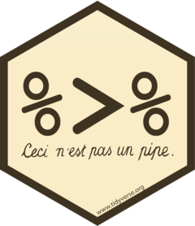

<style>
body {
text-align: justify}
</style>

```{r setup, include=FALSE}
knitr::opts_chunk$set(echo = TRUE, eval = TRUE, message = FALSE, warning = FALSE, collapse = TRUE,  fig.show = "hold", out.width = "100%", fig.align='center', 
                      comment = ' #>', class.output = 'red')
```

```{r klippy, echo=FALSE, include=TRUE}
klippy::klippy(position = c('top', 'right'), color = '#333333', tooltip_message = 'Cliquer pour copier')
library(kableExtra)
```

<br> 

Cette formation a pour but de rendre **accessible à tous** la programmation en R. Pour cela, nous introduirons la notion de programmation dans un contexte général, puis nous nous pencherons sur le langage R en partant d'une vue globale pour entrer petit à petit dans les manipulations techniques. 

```{r icon-style, include=FALSE}
#remotes::install_github("mitchelloharawild/icons")
library(icons)
```

<br>

---

# `r icon_style(fontawesome("code", style = NULL), fill = "#0000CC")` <FONT COLOR="#0000CC">La programmation</FONT>

<br>

* **Qu'est-ce que la programmation ?**

Comme nous l'informe *Wikipédia*, la programmation - aussi appelée **codage** ou **développement**, désigne l'ensemble des activités qui permettent l'écriture de programmes informatiques. Cette écriture de programmes se fait dans un **langage de programmation**, les 10 principaux langages sont les suivants : HTML/CSS, JavaScript, PHP, Ruby, Java, Swift, C#, C ou C++, Python, Julia et Scala. **R** est aussi un langage de programmation qui est, lui, davantage axé sur l'**analyse statistique**.

<br>

* **Pourquoi la programmation ?**

La troisième révolution industrielle, connue sous le nom de "révolution informatique" s'accompagne d'une création de 2.5 trillions d'octets de données chaque jour. C'est dans ce contexte d'**abondance des données** qu'est née la science des données, visant à obtenir des informations et des connaissances à partir des données qui génèrent de la valeur. Le schéma ci-dessous peut aider à comprendre **comment** exploiter la valeur des données :

```{r echo=FALSE, out.width='52%', fig.align='center'}
knitr::include_graphics(here::here("images/cycle_data.png"))
```

<br>

---

# `r icon_style(fontawesome("eye", style = NULL), fill = "#0000CC")` <FONT COLOR="#0000CC">Vue globale du langage R</FONT>

<br>

* **Qu'est-ce que R ?**

Comme dit précédemment R est un **langage de programmation** en libre accès créé en 1993, destiné aux statistiques et à la science des données.

<br>

* **Pourquoi R ?**

```{r echo=FALSE, out.width='52%', fig.align='center'}
knitr::include_graphics(here::here("images/r_cars.jfif"))
```

Gratuit, facile d'accès, puissant, reproductible, design, le langage R est à la fois pertinent pour analyser les données, les visualiser et générer des rapports qui permettent - comme celui-ci, de mélanger du code, du texte et des graphiques. 

<br>

* **Comment coder en R ?**

Pour coder en R on utilise généralement l'interface **R studio** qui permet d'interagir avec le langage R de manière *aisée.* Quoi qu'il en soit, l'image partagée par Sylvain montre que la programmation est un apprentissage infini :

```{r echo=FALSE, out.width='30%', fig.align='center'}
knitr::include_graphics(here::here("images/using_r.jpeg"))
```

<br>

* **Installer R sur sa machine**

Pour installer l'interface RStudio il faut dans un premier temps **installer R** et dans un second temps **télécharger l'application RStudio**. Les liens de téléchargements sont disponibles sur le site [rstudio.com](https://www.rstudio.com/products/rstudio/download/#download). 

<br>

* **Configurer R**

Une fois l'installation terminée, il est important de configurer RStudio pour faciliter le travail sur l'interface et les partages de documents. Les paramètres généraux se trouvent dans le menu : *Tools > Global Options*

Vous pouvez configurer le '*General*' et le '*Code*' de la manière suivante :


```{r echo=FALSE, out.width='90%', fig.align='center', fig.asp=0.55}
library(cowplot)
library(ggplot2)

p1 <- ggdraw() + draw_image("images/options_R.png", scale = 0.9)
p2 <- ggdraw() + draw_image("images/options2_R.png", scale = 0.9)

plot_grid(p1, p2)
```


Il est aussi important de configurer la **sauvegarde** des scripts ; il faut spécifier un codage "UTF-8" pour que les caractères spéciaux de chaque script enregistré soient traités correctement, et ainsi faciliter le partage de codes. Cette option est disponible dans la fenêtre des *Global Options > Code > Saving > Default text encoding > Change... > UTF-8*. Enfin, dans cette même fenêtre des options générales de RStudio - dans l'option "***Appearance***", vous pouvez personnaliser l'apparence de votre interface en modifiant la police, la taille du texte, le thème etc.

```{r echo=FALSE, out.width='90%', fig.align='center', fig.asp=0.55}
p1 <- ggdraw() + draw_image("images/options3_R.png", scale = 0.9)
p2 <- ggdraw() + draw_image("images/options4_R.png", scale = 0.9)
plot_grid(p1, p2)
```

Ne pas oublier d'appliquer ces changements ('*Apply*') avant de fermer la fenêtre des options ('*Ok*').

<br>

* **Décomposition d'une fenêtre R**

Une fenêtre R à son ouverture est décomposée en 3 parties, 4 en diminuant la taille de la partie inférieure en cliquant sur le bouton `r icon_style(fontawesome("window-restore", style = NULL), fill = "#666666")` (ou via le menu : *View > Panes > Show all panes*). La programmation à proprement parler se fait dans la partie supérieure gauche, c'est là où on écrit les scripts que l'on pourra ensuite sauvegarder. 

NB : il est aussi possible de coder directement dans la console (partie inférieure gauche), la commande sera exécutée mais ne sera pas sauvegardée ; ça peut donc être intéressant pour exécuter une commande de manière instantanée (un calcul par exemple).

```{r echo=FALSE, out.width='80%', fig.align='center', strip.white=TRUE}
knitr::include_graphics(here::here("images/demarrage_R.png"))
```

\vspace{-3cm}

La partie inférieure droite est décomposée en 5 onglets :

* **Files** : les fichiers de l'ordinateur
* **Plots** : les graphiques créés apparaîtront ici
* **Packages** : liste de tous les *packages* installés sur la machine (nous reviendrons sur la notion plus tard)
* **Help** : onglet où l'on trouve toute l'aide nécessaire sur l'utilisation des fonctions
* **Viewer** : les objets interactifs créés (graphiques, cartes, tableaux) apparaîtront ici

<br>

* **L'environnement R**

Un avantage incontournable de R est la **communauté** qui existe autour pour trouver des ressources, de l'aide, de l'inspiration etc. On trouve notamment [R-bloggers](https://www.r-bloggers.com/) avec des nouveautés et des tutoriels écrits par des utilisateurs du langage, [RStudio Community](https://community.rstudio.com/) pour trouver/donner de l'aide (comme un *#TeamOpenData* de RStudio), [Stack Overflow](https://stackoverflow.com/) où l'on trouve la majorité des réponses aux questions de programmation - la plateforme n'est cependant pas propre à R. 

Il est aussi possible de relier RStudio à **Git**, ce qui permet de déposer du code, des bases de données et des objets créés (graphiques, cartes, documents html..) sur [github](https://github.com/). Les fichiers sont ainsi centralisés et sauvegardés sur un *repository* qui permet de collaborer facilement sur un projet. 

<br>


* **Le lexique de R**

<FONT COLOR="#CC0000">coder</FONT> = programmer

<FONT COLOR="#CC0000">ligne de commande</FONT> = ligne de code

<FONT COLOR="#CC0000">runer</FONT> = exécuter une commande (bouton '*Run*')

<FONT COLOR="#CC0000">package</FONT> = ensemble de fonctions

<FONT COLOR="#CC0000">library</FONT> = endroit où sont gardés les packages

<FONT COLOR="#CC0000">working directory</FONT> = répertoire de travail

<br>

* **Les types de documents pour travailler avec R**

Les principaux documents que l'on peut créer à partir de l'interface RStudio sont les suivants :

* **R Script**, extension *".R"* **:** document le plus basique où l'on peut (seulement) écrire du code et l'exécuter - très fonctionnel
* **R Markdown**, extension *".Rmd"* **:** document où l'on peut combiner du texte, du code, des graphiques et des tableaux de manière esthétique, comme celui-ci
* **Shiny web app**, extension *".R"* **:** application interactive où l'on peut assembler des visualisations et des tableaux

Pour créer un nouveau document il faut aller dans le menu : *File > New File > choisir celui que vous voulez créer*, ou sur le `r icon_style(fontawesome("plus-circle", style = NULL), fill = "#009900")` juste en dessous du '*File*' dans la barre de menu.

<br>

* **Travailler avec des projets R**

Ces documents peuvent être créés/ouverts **seuls** ou dans un **projet** : {width=3%}. Un *Rproject* est utile dès lors que l'on travaille sur une analyse avec de nombreux fichiers (données, scripts, images...) et en collaboration avec d'autres personnes. Il est effectivement possible d'organiser son espace de travail à partir de l'objet '***.Rproj***' :

* celui-ci se trouve dans un dossier où l'on **centralise tous les fichiers** nécessaires à l'analyse 
* depuis l'emplacement où se trouve le projet on peut créer des **sous-dossiers** pour organiser le travail
* en ouvrant dans RStudio le projet, les fichiers créés autour de celui-ci apparaissent dans la **partie inférieure droite de la fenêtre de RStudio**, ils sont donc accessibles facilement comme nous le voyons ici

<center>

{width=60%}

</center>

<center>

{width=60%}

</center>

<br>

* il est alors possible d'appeler toute sorte d'objets (images, bases de données) en utilisant un **chemin relatif** et non un chemin global. Pour importer des données par exemple, le chemin global serait le suivant :

<center>

`data <- read_csv("C:/Users/name/desktop/mon_projet/data/base.csv")`

</center>

La limite de cette méthode apparaît quand on veut **partager** le code à quelqu'un d'autre qui n'aura pas le même chemin d'accès (ne serait-ce que pour le *nom d'utilisateur*). En travaillant dans un projet R, les chemins d'accès aux documents seront **relatifs** puisqu'ils débutent à l'endroit où l'on travaille (working directory), c'est-à-dire à l'emplacement du *.Rproj*. La commande pour importer les données avec le **chemin relatif** serait la suivante :

<center>

`data <- read_csv("./data/base.csv")`

</center>

Le point "**.**" correspond au répertoire de travail c'est-à-dire à l'emplacement du *RProject* ici. Le dossier avec le projet R peut être déplacé et partagé, l'import continuera de fonctionner grâce au chemin relatif. 

Pour créer un nouveau projet il faut aller dans le menu : *File > New Project > New Directory > New Project > entrer un nom de projet, éventuellement changer l'espace de travail > Create Project*, ou à partir du `r icon_style(fontawesome("plus-circle", style = NULL), fill = "#009900")` juste en dessous du '*Edit*' dans la barre de menu.

<br>

<style>
div.blue { background-color:#efefef; border-radius: 5px; padding: 20px;}
</style>
<div class = "blue">

 `r icon_style(fontawesome("thumbs-up", style = "solid"), fill = "#666666")`  <FONT COLOR="#333333">**Bonne pratique**

Un bon réflexe à prendre dès le début de votre carrière de programmeur est de ne laisser **aucun espace blanc** dans les noms des fichiers/dossiers, de manière à ce qu'ils puissent être lus à la fois par des personnes mais aussi par des machines. Les bons séparateurs des mots sont alors `-`ou `_`. Il est aussi recommandé de ne **pas mettre d'accent**, pour prévenir d'éventuels problèmes d'encodage. 

*Exemple de **mauvais nom** :* `Extraction des données de data.gouv.R`

*Exemple de **bon nom** :* `Extraction_donnees_data-gouv.R`</FONT>

</div>

<br>

---

# `r icon_style(fontawesome("search", style = NULL), fill = "#0000CC")` <FONT COLOR="#0000CC">Science et analyse des données avec R</FONT>

<br>


Maintenant que la notion de programmation est plus claire et que vous connaissez les rouages du langage R, nous allons entrer dans le vif du sujet en apprenant à manier les données ; que ce soit la mise en forme, l'analyse ou la visualisation. Cette partie reprendra étape par étape le schéma d'exploitation des données que nous avons vu en première partie :

```{r echo=FALSE, out.width='52%', fig.align='center'}
knitr::include_graphics(here::here("images/cycle_data.png"))
```

<br>

* **Deux manières de coder en R**

Avant de nous pencher sur l'import de données, voyons les deux manières de coder en R : le R-base et le tidyverse. La programmation dans le langage R a été révolutionnée ces dernières années par le statisticien *Hadley Wickham* et son équipe, qui ont développé le **tidyverse**. Contraction de *tidy* et *universe*, le tidyverse est une collection de packages R qui ont tous la même structure, simplifiant ainsi leur utilisation pour la data science. 


<div class="row">
<div class="col-md-2">
{width=120%}
</div>
<div class="col-md-10">

<br>

Le tidyverse fonctionne grâce au **pipe** (%>%) contenu dans le package `magrittr`, qui permet d'appliquer un certain nombre de fonctions à une base de données. Le code est alors plus lisible grâce à une structuration des séquences d'opérations de **gauche à droite** (et non de l'extérieur à l'intérieur comme en R-base), qui permet d'**ajouter des étapes** n'importe où dans les séquences d'opérations. 
</div>
</div>


Un exemple de code en R-base et en tidyverse : 

* **R-base** : `h(g(f(x)))`
* **tidyverse** : `x %>% f %>% g %>% h`

Nous apprendrons à coder seulement en tidyverse dont l'approche est beaucoup plus simple pour débuter la programmation. 

<br>

* **Coder sous R : les bases**

Pour **exécuter** du code il faut placer son curseur sur la ligne de commande, puis cliquer sur le bouton {width=5.7%} en haut de la fenêtre, ou appuyer sur les touches *Ctrl-Enter*. Pour exécuter plusieurs lignes de code simultanément il suffit de les **sélectionner** avant de les *runer*. vous pouvez notamment vous entraîner en *runant* de simples opérations arithmétiques : 

```{r}
13+4
5*2
13+4-5*2
```


Il est possible d'**assigner** une valeur à un objet (dataframe, liste, vecteur, fonction...) avec `<-` ou `=`, de manière à les **sauvegarder** dans l'environnement de travail (partie en haut à droite de la fenêtre RStudio). Vous pouvez par exemple *runer* les commandes suivantes :

```{r}
# Opérations
x <- 13+4
y <- 5*2

# Calcul du résultat
resultat = x-y
resultat
```


De cette manière, le code sous R se lit de droite à gauche ; 

* **à droite** on trouve la valeur 
* **à gauche** on trouve l'objet créé

<style>
div.blue { background-color:#efefef; border-radius: 5px; padding: 20px;}
</style>
<div class = "blue">

 `r icon_style(fontawesome("thumbs-up", style = "solid"), fill = "#666666")`  <FONT COLOR="#333333">**Bonne pratique**

Tout texte peut être intégré dans un script R après un "**#**" ; il ne sera pas considéré comme du code mais comme un **commentaire** donc ne sera pas exécuté. Un bon réflexe est de mettre le **plus d'explications du code** grâce aux "#", pour qu'il soit lisible et compréhensible par toute personne qui travaillerait sur le script. 

</div>

<br>

* **Installation des packages fondamentaux**

Comme dit précédemment, un *package* contient un certain nombre de **fonctions** qui permettent de faire toutes sortes de manipulations sur des bases de données ou autres. Le *repository* officiel où sont stockés tous les packages R est appelé **CRAN** ; "the Comprehensive R Archive Network". Pour installer un package depuis le CRAN il faut utiliser la fonction `install.packages("nom_package")`. Mais il existe d'autres dépôts des packages créés, tel que Git (GitHub, GitLab, Bitbucket...) ; pour installer un package stocké sur *github* par exemple il faut utiliser la fonction `install_github("user_name/package_name")`, elle-même contenue dans le package **devtools**.


Pour utiliser un package, après l'avoir installé, il faut l'appeler via la fonction `library(nom_package)`. Le code ci-dessous permet d'installer les packages fondamentaux, il faut le copier, le coller dans un script R basique (*File > New File > R Script*) puis l'exécuter. 


*Plusieurs packages sont attachés au "tidyverse" :* 

* **ggplot2** : *pour visualiser les données*
* **tibble** : *pour traiter les données de type 'tibble'*
* **tidyr** : *pour nettoyer les données*
* **readr** : *pour importer des données CSV, TSV ou FWL*
* **purrr** : *pour itérer des fonctions*
* **dplyr** : *pour manipuler les donnée*
* **stringr** : *pour travailler avec des chaînes de caractères*
* **forcats** : *pour travailler avec des variables catégorielles*


```{r  eval=F, echo=T}
packages <- c("tidyverse", "remotes", "devtools", "rmarkdown", "rio", "datasets")
install.packages(packages)
```

<br>

### Importer les données


* **Deux manières d'importer des données en R**

Il est possible d'importer des données dans l'environnement RStudio de deux manières : par un **fichier exporté** présent sur notre machine, ou directement via un **lien** qui pointe vers le téléchargement de ce fichier en ligne. Voici quelques exemples de plates-formes où il est possible d'en importer les données sans besoin préalable d'exporter le fichier :


```{r echo=FALSE, out.width='88%', fig.align='center'}
knitr::include_graphics(here::here("images/import_liens.png"))
```


<style>
div.blue { background-color:#efefef; border-radius: 5px; padding: 20px;}
</style>
<div class = "blue">

 `r icon_style(fontawesome("thumbs-up", style = "solid"), fill = "#666666")`  <FONT COLOR="#333333">**Bonne pratique**

Un autre bon réflexe est de privilégier tant que possible **l'import via un lien**, puisque ça n'implique aucune manipulation extérieure au script, donc une plus grande reproductibilité pour partager ou automatiser le code.

</div>

<br>


* **Les différents types de base de données**

Il existe un certain nombre de formats de jeux de données, nous allons lister les plus courants en précisant la commande qui permet de les lire sous R et importer les données correctement.

<br>

|        &rarr; **Excel** 


```{r eval=F, echo=T}
library(readxl)
data <- read_excel(path = "chemin_acces/vers_le/fichier.xlsx", sheet = "feuille_n_1")  # préciser le nom de la feuille à importer s'il y en a plusieurs
```


<br>


|        &rarr; **CSV** : *Comma Separated Values*

```{r eval=F, echo=T}
library(readr)
data <- read_csv("fichier.csv") 
```


<br>

|        &rarr; **SCSV** : *Semicolon Separated Values*

```{r eval=F, echo=T}
library(readr)
data <- read_delim("fichier.csv", delim = ";") 
```


<br>

|        &rarr; **TXT** ou **TSV** : *Tab Separated Values*

```{r eval=F, echo=T}
library(readr)
data <- read_delim("fichier.txt")  # le délimiteur est reconnu automatiquement par R, c'est "\t" 
# ou
data <- read_table("fichier.txt")
```


<br>

Il existe encore bien d'autres formats de fichiers tels que XML, JSON, SAS... Si besoin, vous trouverez toute l'aide nécessaire sur internet (notamment sur **Stack Overflow** vu en partie précédente). 

<style>
div.yellow { background-color:#FFFFe5; border-radius: 5px; padding: 20px;}
</style>
<div class = "yellow">

 `r icon_style(fontawesome("lightbulb", style = "solid"), fill = "#666666")`  <FONT COLOR="#333333">**Astuce**

Lorsque vous avez un doute sur l'utilisation d'une fonction et que vous voulez savoir quels arguments elle attend et comment les spécifier, vous pouvez placer le curseur de la souris sur le nom de la fonction écrite dans le script puis appuyer sur les touches *Ctrl-F1* ; la **page d'aide** de la fonction s'ouvrira dans la partie inférieure droite (***Help***) de la fenêtre RStudio.

</div>

<br>

Si vous avez un doute pour importer vos données, vous pouvez le faire en presse-bouton via le menu : *File > Import Dataset > From*

* **From Text (base)** : pour lire les fichiers *.csv, .txt, .scsv*, la différence étant dans le séparateur 
* **From Text (readr)** : même fonction qu'en R-base mais ici plus rapide, avec plus d'options et la possibilité d'importer via un lien
* **From Excel** : pour lire les fichiers Excel
* **From SPSS** : pour lire les fichiers SPSS (Statistical Package for the Social Sciences) qui ont l'extension *.sav*
* **From SAS** : pour lire les fichiers SAS (Statistical Analysis Software)
* **From Stata** : pour lire les fichiers exportés depuis Stata, un logiciel de statistiques et d'économétrie

Il est possible de "jouer" avec les paramètres si ceux par défaut ne sont pas bons ; par exemple changer le séparateur de valeurs (***Delimiter***), l'encoding pour reconnaître les caractères spéciaux (***Locale : Configure...***), le nom de la base de données (***Name***), le nombre de lignes à ignorer en cas d'en-tête sur le fichier (***Skip***). Avant de finaliser l'import des données par le menu, il est important de **copier le code** qui apparaît en bas à droite de la fenêtre (***Code Preview***) puis le coller dans le script, pour ne pas refaire cette manipulation à chaque ouverture du script, et pour le rendre reproductible. 


<br>


### Nettoyer les données


* **Les différents types de données**

Entre une liste de **notes d'élèves** et une liste de **noms de villes**, on voit bien que la structure de données est différente. Listons ici les différents types de données qui existent, avant de voir comment les nettoyer : 

<style type="text/css">
.tg  {border-collapse:collapse;border-color:#ccc;border-spacing:0;margin:0px auto;}
.tg td{background-color:#fff;border-color:#ccc;border-style:solid;border-width:1px;color:#333;
  font-family:Arial, sans-serif;font-size:14px;overflow:hidden;padding:10px 5px;word-break:normal;}
.tg th{background-color:#f0f0f0;border-color:#ccc;border-style:solid;border-width:1px;color:#333;
  font-family:Arial, sans-serif;font-size:14px;font-weight:normal;overflow:hidden;padding:10px 5px;word-break:normal;}
.tg .tg-k7ar{background-color:#c0c0c0;border-color:#000000;font-weight:bold;text-align:center;vertical-align:top}
.tg .tg-2q5c{background-color:#efefef;border-color:#000000;font-style:italic;text-align:center;vertical-align:middle}
.tg .tg-i817{background-color:#f9f9f9;border-color:#000000;text-align:left;vertical-align:top}
.tg .tg-73oq{border-color:#000000;text-align:left;vertical-align:top}
.tg .tg-bi3z{background-color:#efefef;border-color:#000000;font-style:italic;text-align:center;vertical-align:middle}
.tg .tg-vnuo{background-color:#efefef;border-color:#000000;font-style:italic;text-align:center;vertical-align:top}
</style>
<table class="tg">
<thead>
  <tr>
    <th class="tg-k7ar">Famille de données</th>
    <th class="tg-k7ar">Structure</th>
    <th class="tg-k7ar">Nom retourné sous R</th>
    <th class="tg-k7ar">Exemple</th>
  </tr>
</thead>
<tbody>
  <tr>
    <td class="tg-2q5c" rowspan="3">quantitatif</td>
    <td class="tg-i817">entier</td>
    <td class="tg-i817">int = integer</td>
    <td class="tg-i817">3</td>
  </tr>
  <tr>
    <td class="tg-73oq">décimal inexact</td>
    <td class="tg-73oq">dbl = double</td>
    <td class="tg-73oq">3.5</td>
  </tr>
  <tr>
    <td class="tg-i817">décimal exact</td>
    <td class="tg-i817">num = numeric</td>
    <td class="tg-i817">3.500001</td>
  </tr>
  <tr>
    <td class="tg-bi3z" rowspan="3">qualitatif</td>
    <td class="tg-73oq">chaîne de caractères</td>
    <td class="tg-73oq">chr = character</td>
    <td class="tg-73oq">Ville de Paris</td>
  </tr>
  <tr>
    <td class="tg-i817">facteur à n niveaux</td>
    <td class="tg-i817">Factor</td>
    <td class="tg-i817">petit / moyen / grand</td>
  </tr>
  <tr>
    <td class="tg-73oq">facteur à 2 niveaux dit "booléen"</td>
    <td class="tg-73oq">bool = boolean</td>
    <td class="tg-73oq">0 / 1, True / False</td>
  </tr>
  <tr>
    <td class="tg-vnuo">autre</td>
    <td class="tg-i817">date</td>
    <td class="tg-i817">POSIX</td>
    <td class="tg-i817">13-12-1998</td>
  </tr>
</tbody>
</table>

<br>

<style>
div.blue { background-color:#efefef; border-radius: 5px; padding: 20px;}
</style>
<div class = "blue">

 `r icon_style(fontawesome("thumbs-up", style = "solid"), fill = "#666666")`  <FONT COLOR="#333333">**Bonne pratique**

Bien que numériques, les **identifiants** tels que numéros de SIREN, numéros de marchés, etc. doivent être considérés comme une **chaîne de caractères** et non une valeur numérique.

</div>

<br>

Une fois importée, il est possible de regarder la *structure* des données qui composent la base grâce à la fonction `str()` :

```{r}
# On importe des données ODS
data(iris)
# On regarde le type des variables qui composent la base
str(iris)
```

*Nous réaliserons toutes sortes de manipulations sur une base de données déjà chargée dans l'environnement RStudio, c'est la base **iris**. Cette base recense des mesures de 4 attributs de 150 fleurs appartenant à 3 familles différentes. Plus d'informations sur la base [sur ce lien](https://www.rdocumentation.org/packages/datasets/versions/3.6.2/topics/iris).* 

<br>

Il arrive que la structure d'une variable ne soit pas la bonne, il faut alors la changer pour avoir les données au bon format. Cela est possible grâce à la fonction `as.type_souhaite()` :

```{r}
# Pour passer en chaîne de caractères la variable "Species"
iris$Species <- as.character(iris$Species)

# Pour passer en nombres décimaux arrondis les 4 autres variables (sans le faire une par une)
iris[,c(1:4)] <- lapply(iris[,c(1:4)], as.double) 
```

<style>
div.yellow { background-color:#FFFFe5; border-radius: 5px; padding: 20px;}
</style>
<div class = "yellow">

 `r icon_style(fontawesome("lightbulb", style = "solid"), fill = "#666666")`  <FONT COLOR="#333333">**Astuce**

Pour accéder à une variable dans une base de données, il et possible d'utiliser le "*\$*". Il fonctionne de la manière suivante ; *base_de_donnees\$variable*.

La fonction *lapply()* permet d'appliquer une fonction à plusieurs variables simultanément et permet ainsi de réduire le nombre de lignes de code dans le script. 

</div>

<br>

<br>

* **Observer les données**

Voilà quelques fonctions pour observer les données lorsqu'elles viennent d'être importées pour les cerner au mieux :

```{r}
# 5 premières lignes
head(iris, 5)

# 5 dernières lignes
tail(iris, 5)

# Nombre de colonnes
ncol(iris)

# Nombre de lignes
nrow(iris)
length(iris)

# Nom des colonnes
names(iris)

# Nombre de lignes ET nombre de colonnes
dim(iris)

# Résumé des valeurs d'une variable
summary(iris$Petal.Length)

# Occurrences des valeurs d'une variable
table(iris$Species)
```

<br>

* **Traiter les valeurs manquantes**

Il arrive souvent que certaines valeurs manquent à une base de données, elles peuvent alors prendre plusieurs écritures : NA, NaN, N/A, NC, NULL... La plus connue étant "NA" qui signifie *Not Available*. La fonction `is.na()` peut être appliquée pour connaître le nombre de valeurs manquantes dans une base de données, et `na.omit()` pour supprimer toutes les lignes qui contiennent au moins 1 valeur manquante.

```{r eval=F, echo=T}
# Compter le nombre de NA dans une colonne
data %>% count(is.na(nom_colonne))

# Retirer toutes les lignes avec au moins 1 NA
new_data <- na.omit(data)
```

<br>

* **Des données propres**

On parle de "*tidy data*" à partir du moment où les données sont propres, c'est-à-dire qu'elles respectent le schéma ci-dessous :

```{r echo=FALSE, out.width='82%', fig.align='center'}
knitr::include_graphics(here::here("images/tidy_data.png"))
```

Chaque ligne est une observation et chaque colonne est une variable correspondant à l'observation en question. Selon le format des données les observations peuvent correspondre à des individus/pays/villes etc. (on parle de **données en coupe**, c'est-à-dire une "photo" d'une situation à un moment précis), à des périodes de temps (on parle de **données temporelles**) ou aux 2 simultanément c'est-à-dire par individu **et** dans le temps (on parle alors de **données de panel**).


<br>


### Transformer les données

* **Les principales fonctions du dplyr**

Dans un premier temps nous allons voir les différentes fonctions qui composent le dplyr et permettent de transformer les données, il s'agit des fonctions suivantes :

- `filter()` : pour sélectionner certaines lignes à partir d'une condition
- `arrange()` : pour réordonner les lignes
- `rename()` : pour changer le nom des colonnes (renommer)
- `select()` : pour sélectionner certaines colonnes
- `mutate()` : pour créer de nouvelles variables
- `summarise()` : pour résumer plusieurs valeurs en 1 valeur (moyenne, médiane, mode...)
- `group_by()` : pour grouper les observations avant d'appliquer une fonction

<br>

|        &rarr; `filter()`

Cette fonction sert à sélectionner des lignes dans une base de données (dataframe ; df). Les lignes qui répondent à un certain critère ou condition logique sont sélectionnées. Les filtres peuvent être appliqués tant aux variables quantitatives que qualitatives. Par exemple : 

```{r}
# On appelle la librairie tidyverse qui contient toutes ces fonctions et le pipe
library(tidyverse)

# Fleurs de l'espèce "versicolor"
df1 <- iris %>% filter(Species == "versicolor")
dim(df1)

# Fleurs dont les pétales sont supérieurs ou égaux à 5 cm
df2 <- iris %>% filter(Petal.Length >= 5)
dim(df2)

# Fleurs de l'espèce versicolor ET dont les pétales sont supérieurs ou égaux à 5 cm
df3 <- iris %>% filter(Species == "versicolor" & Petal.Length >= 5)
dim(df3)

# Fleurs dont les pétales sont exactement larges de 2 OU de 2.5 cm
df4 <- iris %>% filter(Petal.Width == 2 | Petal.Width == 2.5)
dim(df4)
```

Avec le pipe ({width=3%}) on part de la base de données entière puis on applique nos filtres. On obtient ici deux sous-dataframes, et grâce à la fonction `dim()` on voit que l'on a :

- 50 fleurs de l'espèce versicolor
- 46 fleurs dont les pétales sont égaux ou plus longs que 5 cm
- 2 fleurs de l'espèce versicolor dont les pétales sont longs d'au moins 5 cm
- 9 fleurs dont les pétales sont larges d'exactement 2 ou 2.5 cm

Le tableau ci-dessous résume les filtres que l'on peut appliquer sur une plusieurs variable(s) d'une base de données. Pour filtrer des variables qualitatives il faut mettre la condition entre guillemets pour que la machine reconnaisse qu'il s'agit d'un texte. 

<style type="text/css">
.tg  {border-collapse:collapse;border-color:#ccc;border-spacing:0;margin:0px auto;}
.tg td{background-color:#fff;border-color:#ccc;border-style:solid;border-width:1px;color:#333;
  font-family:Arial, sans-serif;font-size:14px;overflow:hidden;padding:10px 5px;word-break:normal;}
.tg th{background-color:#f0f0f0;border-color:#ccc;border-style:solid;border-width:1px;color:#333;
  font-family:Arial, sans-serif;font-size:14px;font-weight:normal;overflow:hidden;padding:10px 5px;word-break:normal;}
.tg .tg-baqh{text-align:center;vertical-align:top}
.tg .tg-k7ar{background-color:#c0c0c0;border-color:#000000;font-weight:bold;text-align:center;vertical-align:top}
.tg .tg-c3ow{border-color:inherit;text-align:center;vertical-align:top}
.tg .tg-txu4{background-color:#f9f9f9;border-color:inherit;font-style:italic;text-align:left;vertical-align:top}
.tg .tg-71bg{background-color:#f9f9f9;border-color:inherit;font-style:italic;text-align:left;vertical-align:middle}
.tg .tg-abip{background-color:#f9f9f9;border-color:inherit;text-align:center;vertical-align:top}
.tg .tg-btxf{background-color:#f9f9f9;border-color:inherit;text-align:left;vertical-align:top}
.tg .tg-0lax{text-align:left;vertical-align:top}
.tg .tg-0pky{border-color:inherit;text-align:left;vertical-align:top}
</style>
<table class="tg">
<thead>
  <tr>
    <th class="tg-k7ar">Equation</th>
    <th class="tg-k7ar">Traduction pour R</th>
    <th class="tg-k7ar">Exemple</th>
  </tr>
</thead>
<tbody>
  <tr>
    <td class="tg-71bg">égal</td>
    <td class="tg-abip">==</td>
    <td class="tg-btxf">Species == "versicolor"</td>
  </tr>
  <tr>
    <td class="tg-0lax"><span style="font-style:italic">différent</span></td>
    <td class="tg-baqh">!=</td>
    <td class="tg-0lax">Species != "setosa"</td>
  </tr>
  <tr>
    <td class="tg-txu4">supérieur</td>
    <td class="tg-abip">&gt;</td>
    <td class="tg-btxf">Petal.Length &gt; 5</td>
  </tr>
  <tr>
    <td class="tg-0pky">supérieur ou égal</td>
    <td class="tg-c3ow">&gt;=</td>
    <td class="tg-0pky">Petal.Length &gt;= 5</td>
  </tr>
  <tr>
    <td class="tg-btxf">inférieur</td>
    <td class="tg-abip">&lt;</td>
    <td class="tg-btxf">Petal.Length &lt; 5</td>
  </tr>
  <tr>
    <td class="tg-0pky">inférieur ou égal</td>
    <td class="tg-c3ow">&lt;=</td>
    <td class="tg-0pky">Petal.Length &lt;= 5</td>
  </tr>
</tbody>
</table>

<br>

|        &rarr; `arrange()`

Cette fonction sert à réordonner les observations selon un ordre alphabétique ou numérique croissant ou décroissant. Quelques exemples ci-dessous : 

```{r}
# On trie par longueur de sépale ascendante
iris <- iris %>% arrange(Sepal.Length)

# On trie par longueur de pétale descendante
iris <- iris %>% arrange(desc(Petal.Length))

# On trie par espèce puis par largeur de pétale ascendante
iris <- iris %>% arrange(Species, Petal.Width)
```

<br> 

<style>
div.blue { background-color:#efefef; border-radius: 5px; padding: 20px;}
</style>
<div class = "blue">

 `r icon_style(fontawesome("thumbs-up", style = "solid"), fill = "#666666")`  <FONT COLOR="#333333">**Bonne pratique**

Ici nous avons attribué les changements sur la même base de données "iris", ce qui a **"écrasé"** l'ancienne par la nouvelle dans laquelle les observations sont triées d'une certaine manière. Lorsque vous êtes sûrs de vos modifications vous pouvez attribuer les modifications au même nom d'objet ce qui écrasera l'ancien, mais dès lors que vous voulez garder une trace de la base initiale il convient de **créer un nouvel objet**, c'est-à-dire avec un nouveau *nom* qui apparaîtra dans votre environnement de travail (partie supérieure droite de la fenêtre RStudio). 

</div>

<br>

|        &rarr; `rename()`

Cette fonction permet de renommer une ou plusieurs colonnes d'un dataframe, elle fonctionne de la manière suivante : `data <- data %>% rename(nouveau_nom = ancien_nom)`. Ci-dessous un exemple :

```{r}
# On renomme 2 colonnnes
iris <- iris %>% rename(espece = Species,
                        longueur_petale = Petal.Length)

# Noms de colonnes en majuscules
names(iris) <- names(iris) %>% toupper

# Noms de colonnes en minuscules
names(iris) <- names(iris) %>% tolower
```


<br>

|        &rarr; `select()`

Cette fonction permet de sélectionner certaines colonnes, cela est possible en les identifiant par leur nom ou leur place dans le dataframe (numéro de colonne). Quelques exemples :

```{r}
# Sous df (dataframe) avec 2 colonnes
df5 <- iris %>% select(espece, sepal.width)
  # ou
df5_bis <- iris %>% select(5, 2)

# Sous df sans 1 colonne
df6 <- iris %>% select(-longueur_petale)
  # ou
df6_bis <- iris %>% select(-3)

# Sous df sans 2 colonnes
df6 <- iris %>% select(-c(longueur_petale,petal.width)) # c() permet de mettre dans 1 objet plusieurs arguments séparés par des virgules
  # ou
df6_bis <- iris %>% select(-c(3,4))

# On change l'ordre des colonnes
iris <- iris %>% select(5,2:4,1)
```


<style>
div.yellow { background-color:#FFFFe5; border-radius: 5px; padding: 20px;}
</style>
<div class = "yellow">

 `r icon_style(fontawesome("lightbulb", style = "solid"), fill = "#666666")`  <FONT COLOR="#333333">**Astuce**

Lorsqu'un nom de colonne contient un espace (par exemple : taille individu) il faut l'entourer de **\`** pour qu'il soit reconnu comme le nom d'une seule colonne par R. Sans cette astuce, la commande ne pourra pas s'exécuter, d'où l'importance de nommer les bases de données et leurs variables par des noms séparés par les caractères `-` ou `_`. 

*Exemple de **mauvaise commande** :* data\$premier nom <- as.numeric(data\$premier nom)

*Exemple de **bonne commande** :* data\$\`premier nom\` <- as.numeric(data\$\`premier nom\`)</FONT>


</div>

<br>


|        &rarr; `mutate()`

Cette fonction permet de créer de nouvelles variables à partir des variables existantes, elle est très utile pour l'analyse de données. Elle fonctionne de la manière suivante : `data <- data %>% mutate(nouvelle_colonne = ancienne_colonne*100)`. La "*mutation*" peut être arithmétique comme textuelle. 

```{r}
# On créé 1 colonne et on modifie 1 autre
iris <- iris %>% mutate(pourcentage_max_petale_width = petal.width / max(petal.width) *100,
                        espece = paste("L'espèce est", espece, sep = ": "))

# On affiche les 5 premières lignes des variables crées
head(iris[,c(1,6)], 5)
```

La commande ci-dessus a par exemple permis de créer une variable qui informe à combien de points de pourcentage la largeur du pétale se situe par rapport à la largeur maximale. En deuxième argument de la fonction `mutate()` on modifie la variable *espece* (on écrase l'ancienne variable) en ajoutant du texte grâce à la fonction `paste()`. Cette dernière permet de **coller du texte**, ici avant chaque espèce de fleur on ajoute "*L'espèce est:* ", puis on colle le nom actuel de l'espèce qui se trouve dans la base (***sep*** correspondant au séparateur entre le texte ajouté et l'ancienne valeur). 

<br>

|        &rarr; `summarise()`

Cette fonction permet de **résumer** plusieurs valeurs en une seule, ce qui est très utile pour avoir quelques statistiques sur les bases de données. 

```{r}
# Calcul de la longueur moyenne des pétales
iris %>% summarise(moyenne_PL = mean(longueur_petale))

# Calcul de la largeur maximale des sépales
iris %>% summarise(max(sepal.width))

# Calcul des minimums des mesures des pétales
iris %>% summarise(min(petal.width),
                   min(longueur_petale))
```

On peut aussi calculer des statistiques sur **toutes les variables** à la fois avec la fonction `summarise_all()` :

```{r}
# Calcul des médianes de toutes les variables
iris %>% summarise_all(median)

# Calcul des écart-types et de la variance 
iris %>% select(-espece) %>% summarise_all(list(sd, var))  #list() quand plusieurs mesures à la fois
```

On voit que la médiane n'a pas été calculée pour la variable '*espece*' puisqu'elle n'est pas numérique, la valeur retournée est donc *NA* (Not Available). Pour la deuxième commande qui calcule l'écart-type et la variance on exclut donc cette variable qualitative grâce à la fonction `select()` que nous avons vu précédemment. 

<br>

|        &rarr; `group_by()`

Cette dernière fonction principale du tidyverse permet de grouper les variables, elle est spécialement utile en analyse de données pour calculer des statistiques par groupe (genre, pays, espèce...). `group_by()` prend le dataframe et le converti en une base groupée pour laquelle les opérations seront effectuées non plus sur la base entière mais pour chacun des groupes identifiés. 

```{r}
# Nombre d'observations par groupe
iris %>% group_by(espece) %>% summarise(n())

# Calcul de la taille moyenne des pétales par espèce
iris %>% group_by(espece) %>% summarise(mean(longueur_petale))
```

On voit par exemple que l'on a 50 fleurs par espèce dans notre base, et qu'en moyenne l'espèce *virginica* a les plus longs pétales : 5.55cm. 

<br>

* **Les jointures**


<br>


### Visualiser les données

<br>


### Communiquer


<br>


RMD

- themes possibles par défaut : texte
https://www.datadreaming.org/post/r-markdown-theme-gallery/

- themes ds autres packages pour du texte html
https://bookdown.org/yihui/rmarkdown/html-document.html#appearance-and-style

- themes possibles par défaut : code
https://eranraviv.com/syntax-highlighting-style-in-rmarkdown/

<br>

---

# `r icon_style(fontawesome("book", style = NULL), fill = "#0000CC")` <FONT COLOR="#0000CC">Bibliographie</FONT>


